# openSensus Architecture

[English](architecture.md) | [简体中文](architecture.zh-CN.md)

This document explains how the openSensus runtime is put together and why it is built
that way. It is aimed at people who want to run it, extend it, or fork it.

For the normative wire contract, read the
[protocol specification](sensus-protocol-v0.1.md). For a step-by-step guide to
connecting a system or an agent, read the [integration guide](integration-guide.md).

---

## 1. What openSensus is

openSensus is a **perception layer for AI agents**. Enterprise systems submit
append-only Observations; the runtime projects current state, detects
evidence-backed Signals, and exposes a bounded, permission-filtered world view over
MCP.

Two boundaries define the product:

- **openSensus is not an action protocol.** Agents use openSensus to understand the world
  and use other tools to change it. Every v0.1 MCP tool is read-only.
- **openSensus does not replace source-specific MCP servers.** It reports *where* and
  *why* to look, then hands deep inspection off to a vertical MCP. openSensus never
  proxies source credentials and never executes source actions.

The design problem it solves: an agent given N enterprise MCP servers has no way to
know what changed, and burns its context window discovering it. openSensus keeps that
discovery cheap by doing continuous perception in a database, so the agent only
spends model tokens when something material actually happened.

### System context

```mermaid
flowchart LR
    subgraph SRC["Enterprise systems"]
        GL["GitLab"]
        JI["Jira"]
        OT["CRM / ERP / HRIS"]
    end

    subgraph PROD["Producers"]
        WH["Webhook handler"]
        PO["Polling connector"]
        BA["CDC / batch importer"]
    end

    RT["<b>openSensus Runtime</b><br/>append-only Observations<br/>world projections<br/>metrics &amp; signals"]

    AG["<b>Agent Harness</b><br/>scheduled / signal-triggered"]

    VM["<b>Vertical MCP servers</b><br/>GitLab MCP, Jira MCP, ..."]

    SRC --> PROD
    PROD -->|"Observation API<br/>HTTP, append-only"| RT
    RT -->|"openSensus MCP<br/>6 read-only tools"| AG
    AG -->|"capability hint<br/>e.g. gitlab.merge_request.read"| VM
    VM -->|"deep inspection &amp; actions"| SRC

    style RT fill:#e8f0fe,stroke:#4285f4,stroke-width:2px
    style AG fill:#fef7e0,stroke:#f9ab00
    style VM fill:#f1f3f4,stroke:#5f6368
```

### How it works

The runtime does one thing: it turns a stream of facts into a queryable,
permission-filtered world view.

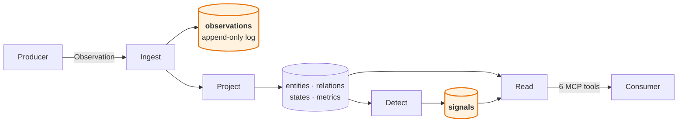

**The core idea: the log is the only truth, and every table is a cache.**

An Observation is appended and never modified. Nothing else is authoritative — `entities`,
`relations`, `states`, `metrics` and `signals` are all *derived* from that log, and all of
them can be thrown away and recomputed.

Almost everything else in the design falls out of that one property:

- **Correcting a bad fact** marks the log entry invalid and replays the subject.
- **A snapshot that no longer contains a record** becomes a synthesized log entry, not a
  silent delete.
- **Changing a detection rule** wipes the Signal index and recomputes it from the metrics
  in the log.

None of those need machinery of their own, because none of them are special cases: they
are all *discard projections, replay the log*.

Three properties worth knowing before the detail:

- **Reads are always consistent with writes.** Projection runs inside the same transaction
  as the append, so a read never sees a fact without its projections.
- **Answers carry evidence.** Every derived value names the Observations it came from, and
  a Signal is visible only to a caller who can read all of its evidence.
- **Every read is bounded.** Limits, depth caps and `truncated` flags are enforced by
  construction, because these answers are destined for a model's context window.

### Where to go deeper

| Question | Section |
| --- | --- |
| What are the moving parts, and which is the pending refactor? | [§3 Component map](#3-component-map) |
| Why is one table different from the other nine? | [§5 The log and its projections](#5-the-log-and-its-projections) |
| What happens to a single Observation? | [§6 Write path](#6-write-path) |
| How do corrections and snapshots actually work? | [§7](#7-corrections-and-deterministic-replay) · [§8](#8-snapshot-reconciliation) |
| How are Signals produced, and why is that not a DSL? | [§9 Signal detection](#9-signal-detection) |
| How is access enforced, including on derived data? | [§11 Access control](#11-access-control) |
| What does an agent actually see? | [§12 Agent integration flow](#12-agent-integration-flow) |
| What does not work yet? | [§14 Known limits](#14-known-limits) |

---

---

## 2. Design principles

Nine principles drive most implementation decisions. The first eight are normative
in the protocol ([§4](sensus-protocol-v0.1.md)); the last is architectural.

| # | Principle | Where it shows up |
| --- | --- | --- |
| 1 | Observations are append-only facts and MUST NOT be mutated | `observations.payload_json` is written once; corrections add rows |
| 2 | Current state is a projection, not the source of truth for history | Every table except `observations` can be dropped and rebuilt |
| 3 | Every derived value MUST be traceable to evidence | `signals.evidence` + `detection.definition` frozen at detection time |
| 4 | Source occurrence time and observation time MUST stay distinct | `occurred_at` / `observed_at` / `received_at` |
| 5 | Producers MAY send incomplete knowledge | `entity.observed` is a partial patch; missing attribute means unknown |
| 6 | Unknown types and fields MUST be preserved | No ontology enforcement; `attributes_json` is free-form |
| 7 | Reads MUST be filtered by the calling Consumer's identity | Filtering happens in `SensusStore`, adjacent to the SQL |
| 8 | v0.1 MCP tools MUST be read-only | `src/mcp.ts` registers no mutating tool |
| 9 | Derived reasoning is never silently rewritten | Rule changes rebuild Signals; historical detection text is retained |

Principle 2 is the load-bearing one — see [§5](#5-the-log-and-its-projections).

---

## 3. Component map

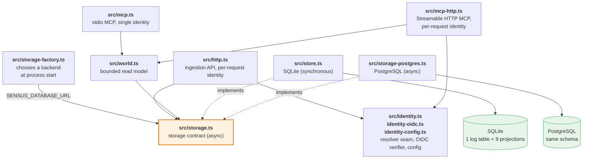

`SensusWorld` and the ingestion API depend on the contract, never on a backend. The
factory resolves that dependency once, at startup, so no other module knows which
database is behind it.

| Module | Responsibility |
| --- | --- |
| `src/protocol.ts` | The type contract. Zod schemas for `EntityRef`, `SourceRef`, `EvidenceRef`, `AccessPolicy`, the five Observation kinds, and `Signal`. Also `canonicalJson` / `contentHash` / `stableId` helpers. |
| `src/store.ts` | The SQLite implementation. Ingestion, idempotency, per-kind projection, corrections and replay, snapshot reconciliation, rule storage and Signal evaluation, and all ACL-filtered reads. |
| `src/storage.ts` | The backend-neutral storage contract, and the two invariants any implementation must hold. |
| `src/storage-sqlite.ts` | Adapts the synchronous SQLite store to the contract, so both backends can be held to one conformance suite. |
| `src/storage-postgres.ts` | The PostgreSQL implementation of the same contract. |
| `src/storage-factory.ts` | Chooses the backend at process start from `SENSUS_DATABASE_URL`, and redacts the password from the connection string before logging it. |
| `src/world.ts` | The bounded read model. Input schemas and implementations for the six tools, graph traversal orchestration, metric aggregation, cursor encoding. |
| `src/mcp.ts` | stdio MCP tool registration and process bootstrap. |
| `src/mcp-http.ts` | MCP over Streamable HTTP. Resolves identity per request and builds a `SensusWorld` per request, which is what lets one endpoint serve many identities. |
| `src/node-http.ts` | Bridges the fetch-based MCP handler onto Node's `http` server. |
| `src/access.ts` | `ConsumerContext`, the `canRead` decision, and policy composition (`combinePolicies`). |
| `src/identity.ts` | The `IdentityResolver` seam, declarative claim mapping, and the API-key, anonymous, and anonymous-fallback resolvers. |
| `src/identity-oidc.ts` | The OIDC/JWT verifier: discovery, JWKS caching, and asymmetric-algorithm allowlist. |
| `src/identity-config.ts` | Loads the JSON identity configuration named by `SENSUS_IDENTITY`. |
| `src/signal-rules.ts` | `SignalRule` schema, `ruleApplies` matching, `evaluateRule` for both condition kinds, and the built-in default rule. |
| `src/http.ts` | The ingestion API. Routes, identity, tenant resolution, request size limits, protocol error responses. |

There is **no async worker, no queue, and no background scheduler**. Projection runs
synchronously inside the same transaction as the insert.

That is a deliberate **consistency** choice, not a shortfall, and it is worth being
precise about what it buys:

- A read can never observe an Observation whose projections have not been applied, so
  no read path has to handle "pending" state.
- Idempotency is trivial: the log row and its projections commit together, so a retry
  sees both or neither.
- Failures surface on the request. A malformed correction is a `409`, not a message in
  a dead-letter queue nobody watches.
- There is no broker to operate, monitor, or back up — which matters for a project
  meant to be self-hosted.

The protocol anticipates the alternative. [§10](sensus-protocol-v0.1.md) says
"projection processing is allowed to lag behind ingestion" and requires only that reads
expose a watermark. This runtime chooses the stronger guarantee and reports a watermark
anyway.

The cost is throughput, and the size of that cost is measurable rather than assumed.
Against PostgreSQL on one machine, with the connection pool warm:

| Workload | Throughput |
| --- | --- |
| Sequential, any kind | ~235 observations/s |
| 16 concurrent writers, **different** subjects | ~900 observations/s (3.7–4.1×) |
| 16 concurrent writers, **the same** subject | ~375 observations/s |

Two things follow. Signal evaluation scales with concurrency as well as plain projection
does, so it is not a hidden serialization point. And the real ceiling is **per-subject
contention** ([§6.6](#66-concurrency)), not the synchronous model — a single entity
cannot absorb more than a few hundred updates per second, whatever the concurrency. For
connector workloads — webhooks, polling, CDC — that is orders of magnitude of headroom.

Where the design genuinely costs something is the batch endpoint, which processes items
one at a time ([§14](#14-known-limits)).

---

## 4. Layering and dependency direction

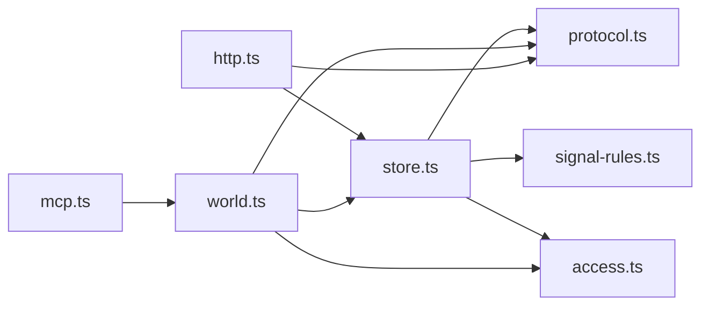

Dependencies point inward toward `protocol.ts`. `store.ts` has no knowledge of HTTP
or MCP; `world.ts` has no knowledge of transport. The two entry points (`http.ts`,
`mcp.ts`) are the only modules that touch the outside world, and each is a thin
adapter.

A practical consequence for contributors: `SensusWorld` and `SensusStore` are both
plain constructible classes, so tests drive them directly without a server. The test
suite does exactly that for storage and projection behaviour, and only spins up
transport for the HTTP and MCP tests.

---

## 5. The log and its projections

This is the architectural core. `observations` is an append-only log and the only
system of record. Every other table is a **derived projection that can be deleted and
rebuilt** from the log.

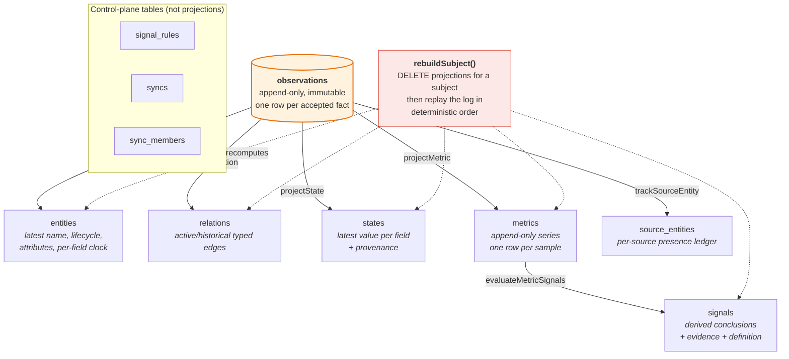

Three independent requirements are satisfied by this one property:

1. **Corrections** — invalidating an Observation requires recomputing everything
   downstream of it ([§7](#7-corrections-and-deterministic-replay)).
2. **Reconciliation** — deleting an entity must not orphan its relations, states,
   metrics, or Signals ([§8](#8-snapshot-reconciliation)).
3. **Rule changes** — editing a detection rule must re-evaluate existing metric
   series ([§9](#9-signal-detection)).

All three are implemented as "throw the projection away and replay". No incremental
patching logic exists anywhere, which is why the codebase stays small.

### Schema

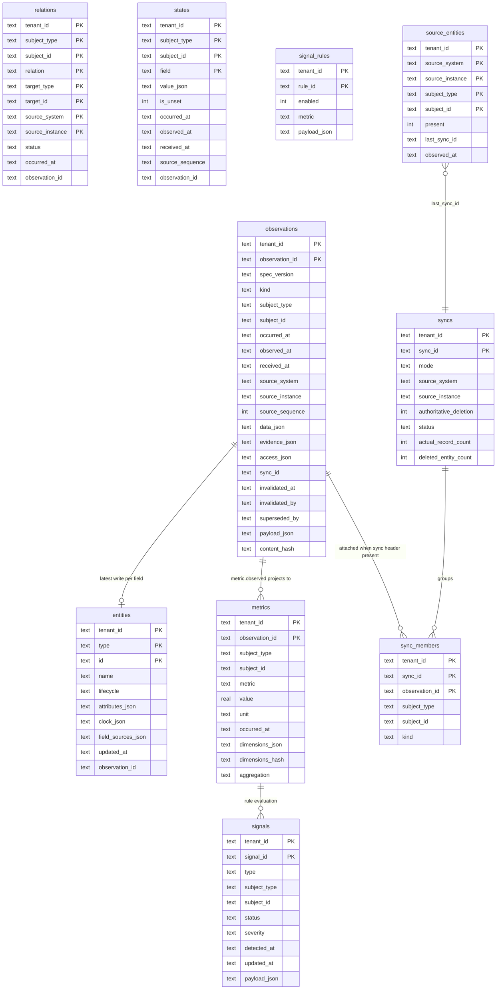

Every projection table carries `tenant_id` in its primary key, so tenant isolation is
a storage-level invariant rather than a query-time filter. There are no SQL foreign
keys between the log and the projections: the relationship is maintained by
`project*` methods, and integrity is restored by replay, not by cascading deletes.

`access_json` lives **only** on `observations`. Projections store the
`observation_id` that produced them and re-resolve the policy at read time. This is
why changing an access policy requires deleting and re-ingesting, and why the
filtering helpers in `store.ts` always look up the originating Observation.

---

## 6. Write path

### 6.1 Ingestion pipeline

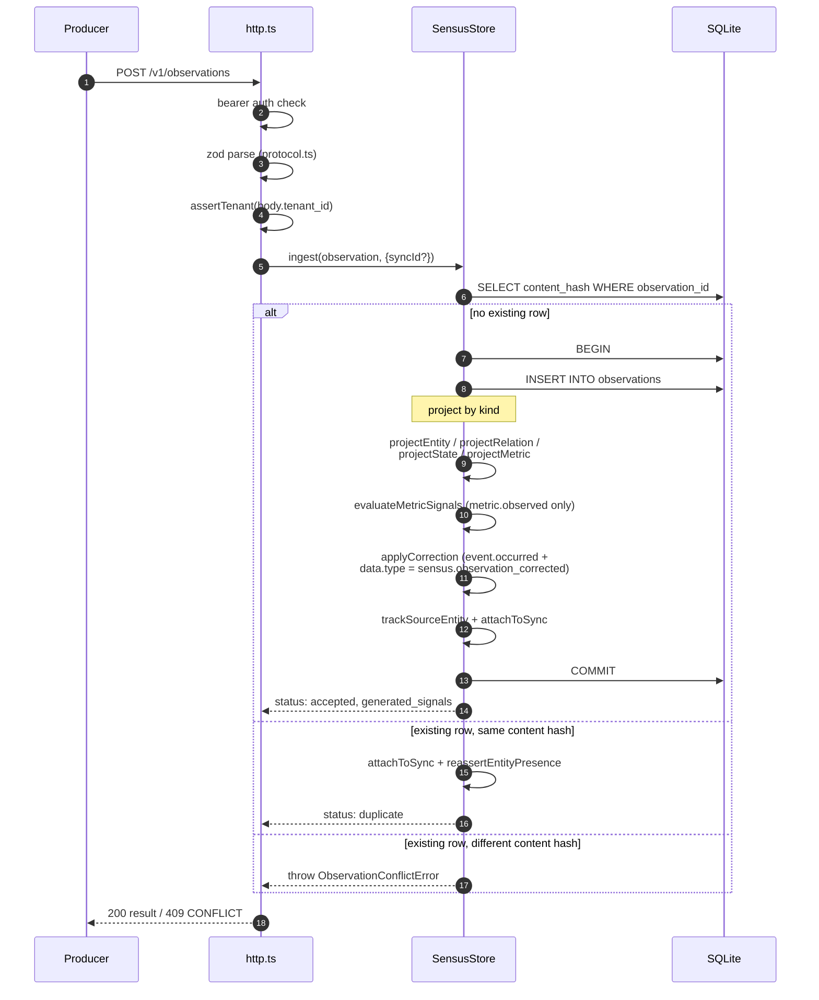

The entire projection work for one Observation is a single transaction. If any step
throws — a malformed correction, a sync source mismatch — the insert is rolled back
and no partial projection is left behind.

### 6.2 Idempotency and conflict

`observation_id` is unique per tenant. The runtime stores a SHA-256 hash of the
**canonical** payload (`canonicalJson` sorts object keys recursively) so that
key-order differences between two serializations of the same fact do not look like a
conflict.

| Incoming | Condition | Result |
| --- | --- | --- |
| Same `observation_id` | canonical hash matches | `status: "duplicate"`, HTTP 200, no projection work |
| Same `observation_id` | canonical hash differs | `ObservationConflictError`, HTTP 409 |
| New `observation_id` | — | `status: "accepted"`, projection runs |

The duplicate path is not a no-op when a `Sensus-Sync-Id` header is present: it still
attaches the Observation to the sync and can trigger presence re-assertion. This is
what makes "re-send the whole snapshot" a valid reconciliation strategy — see
[§8](#8-snapshot-reconciliation).

### 6.3 The three clocks

| Field | Assigned by | Meaning | Mutable |
| --- | --- | --- | --- |
| `occurred_at` | Producer | When the fact became true in the source world | No, part of the payload |
| `observed_at` | Producer | When the Producer saw or extracted it | No, part of the payload |
| `received_at` | Runtime | When openSensus accepted it | No, set once at insert |

`occurred_at` drives every ordering and freshness decision. `received_at` is the
tiebreaker of last resort, and is what the `watermark` in read metadata reports.
Keeping them separate is what allows a late-arriving Observation to be placed
correctly in the timeline instead of being treated as new.

Every producer-supplied instant is normalized to UTC on the way in, milliseconds
included. The protocol accepts any RFC 3339 offset, but every comparison here — the
per-field clocks, the replay order, `ORDER BY occurred_at` — compares the stored value
as a string, and `2026-01-01T10:00:00+02:00` does not sort before
`2026-01-01T09:00:00Z` even though it is the earlier instant. Normalizing to one shape
is what makes a string comparison a real comparison, and it has two visible
consequences: a Producer cannot reorder anything by changing offsets, and re-sending an
instant expressed in a different offset is a duplicate rather than a conflict.

### 6.4 Per-kind projection semantics

Each Observation kind has a different merge discipline. This is the most deliberate
part of the design — it is not one uniform upsert.

| Kind | Projection | Merge rule | Rationale |
| --- | --- | --- | --- |
| `entity.observed` | `entities` | Per-field last-write-wins on `occurred_at`, tracked in `clock_json` | Two producers may describe different attributes of the same entity; a partial patch must not erase fields it did not mention |
| `relation.observed` | `relations` | LWW on the tuple `(tenant, subject, relation, target, source)`, guarded by `occurred_at` | Relation identity includes the source, so two systems can disagree about the same edge without overwriting each other |
| `state.observed` | `states` | LWW on `(occurred_at, source_sequence, received_at)` — **late arrivals never overwrite newer state** | State is a single value per field; a late observation must not roll it backwards |
| `metric.observed` | `metrics` | Pure append; primary key is `observation_id` | Metrics are a series, not a value. Merging them would destroy history |
| `event.occurred` | `observations` only | Never mutates a projection; additionally interpreted as a correction command when `data.type` is `sensus.observation_corrected` | Events are timeline facts |

The `entity.observed` row deserves emphasis. `field_sources_json` records **which
Observation wrote each field**:

```jsonc
// entities.clock_json          - when each field was last written
{ "name": "2026-09-15T09:00:00Z", "attribute:security_risk": "2026-09-16T11:00:00Z" }

// entities.field_sources_json  - by which Observation
{ "name": "obs_change", "attribute:security_risk": "obs_change_secret" }
```

That single mapping delivers two features at once: per-field conflict resolution, and
per-field access control ([§11](#11-access-control)).

### 6.5 Ordering used by replay

When projections are rebuilt, Observations for a subject are replayed in this total
order, which is also the tiebreaker used for `state.observed`:

```sql
ORDER BY occurred_at ASC,
         COALESCE(source_sequence, -1) ASC,
         received_at ASC,
         observation_id ASC
```

`occurred_at` first, then the source's own sequence number when the Producer provides
one, then receipt order, then `observation_id` as a final deterministic tiebreak so
that replaying the same log twice always produces byte-identical projections.

### 6.6 Concurrency

`projectEntity` and `projectState` read the current row, merge in JavaScript, and write
it back. Two writers doing that simultaneously would lose one of the updates, so the
PostgreSQL backend serializes projection work per subject with a transaction-scoped
advisory lock:

```sql
SELECT pg_advisory_xact_lock(hashtext($tenant), hashtext($subject))
```

The lock is held until the transaction ends, which makes the read-merge-write atomic for
one subject while leaving different subjects fully concurrent. Per subject is the right
granularity because it is exactly the unit the projection logic assumes: no projection
reads across subjects, except `reevaluateAllSignals` and the reconciliation sweep — and
those are either self-healing (the next sample recomputes the Signal) or already guarded
by `SELECT ... FOR UPDATE`.

Two races are arbitrated by the primary key rather than a lock, because a check-then-act
would let both callers pass the check:

| Race | Arbitration |
| --- | --- |
| Two writers inserting the same `observation_id` | The observations primary key. The loser catches `23505`, retries, and takes the duplicate path — so it sees a duplicate or a conflict, never a driver error |
| Two writers opening the same `sync_id` | The syncs primary key. The loser gets a `SyncError` |

SQLite needs none of this: one writer at a time is a stronger guarantee than per-subject
locking. `busy_timeout` makes a second process wait for the lock rather than failing
immediately with `SQLITE_BUSY`.

[`test/conformance.ts`](../test/conformance.ts) holds both backends to these behaviours.
Two details make those cases real rather than decorative: they run only for a pooled
backend, because a single SQLite connection cannot overlap anything and would pass
without testing anything; and they warm the pool first, because a pool creates
connections lazily and an unwarmed burst of parallel calls is staggered by connection
setup instead of racing.

---

## 7. Corrections and deterministic replay

Producers get things wrong. openSensus never mutates an accepted Observation; a
correction is itself an `event.occurred` Observation carrying a control message.

```json
{
  "kind": "event.occurred",
  "subject": { "type": "software.change", "id": "gitlab:acme/payments-api!3812" },
  "data": {
    "type": "sensus.observation_corrected",
    "attributes": {
      "target_observation_id": "obs_01K57YB5WVEQNHQN2SMQEZHZZF",
      "disposition": "invalid",
      "replacement_observation_id": "obs_01K57YNEW8BT4VNJ9VN6HK5FQK"
    }
  }
}
```

`disposition` is `invalid` or `superseded`. The target row is flagged
(`invalidated_at`, `invalidated_by`, `superseded_by`) but **never deleted** — it
remains in the log for audit, and disappears only from projections and authorized
reads.

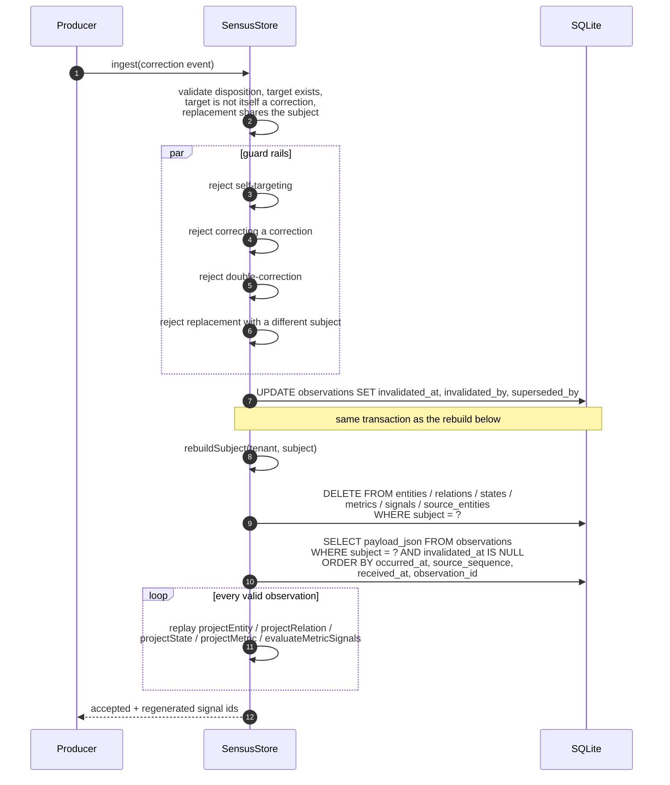

The flag update and the full rebuild run in **one transaction**, so a reader never
observes a half-rebuilt subject. Rebuilding also re-runs Signal detection, which is
why a correction can both create and resolve Signals as a side effect.

Constraints enforced before anything is written (`applyCorrection` in `src/store.ts`):

- `target_observation_id` must exist in the same tenant
- `disposition` must be exactly `invalid` or `superseded`
- an Observation cannot correct itself
- a correction event cannot target another correction event
- a target cannot be corrected twice by different corrections
- a replacement must describe the same subject as its target

---

## 8. Snapshot reconciliation

Event delivery is lossy. Systems also contain data that predates openSensus. So a
conforming Producer periodically sends a full snapshot, and the runtime must be able
to conclude "this record no longer exists" — safely.

The hard part is that absence cannot be inferred from a list of present records, and
one source must never be allowed to delete an entity that another source still
reports. openSensus solves this with a **per-source presence ledger**.

### The presence ledger

`source_entities` holds one row per `(tenant, source, entity)` with a `present` flag
and the `last_sync_id` that asserted it. Only `entity.observed` Observations feed it.

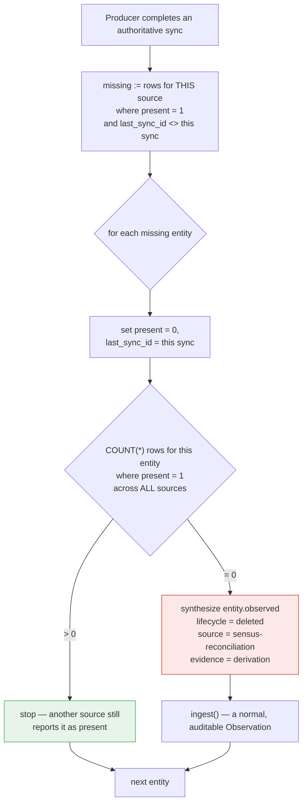

Two properties follow:

- **Deletion is conservative.** An entity is marked deleted only when the completed
  snapshot was authoritative *and* no other source currently reports it as present.
- **Deletion is auditable.** It is a synthesized Observation with `derivation`
  evidence pointing at the sync, not a silent `UPDATE` or `DELETE`. It flows through
  the normal ingest path, so it projects, evaluates, and reads back like any other
  fact.

### Full reconciliation sequence

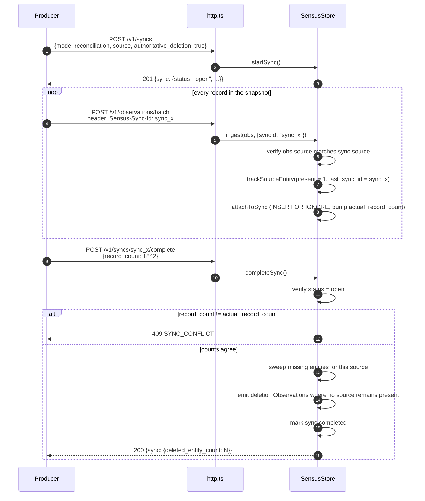

The count check matters. Without it, a truncated or partially-failed snapshot would
look like a legitimately smaller world and mass-delete live entities. Requiring the
Producer's claimed `record_count` to equal the idempotently attached member count
turns that failure mode into an explicit `409`.

### Reappearance

If a previously deleted record shows back up, the projection is restored — and the
restoration is also an Observation. When a re-sent snapshot Observation arrives as an
idempotent duplicate inside a new sync, `reassertEntityPresence` checks whether the
current projection says `lifecycle = "deleted"`. If so, it synthesizes an
`authoritative-presence` Observation with `occurred_at = now`, which is newer than the
deletion and therefore wins.

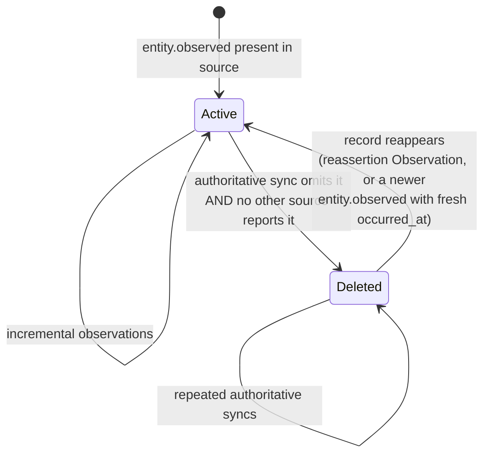

---

## 9. Signal detection

A Signal is a runtime conclusion that a change deserves attention. It is explicitly
**not** an input Observation, and the MCP server instructions tell the agent to treat
Signals as derived and verify them through evidence.

### Rule model

v0.1 supports two structured conditions instead of a general-purpose expression
language. This is a deliberate scope limit ([protocol §19](sensus-protocol-v0.1.md)):
no DSL until the reference implementation produces evidence that one is needed.

| Condition | Fields | Fires when |
| --- | --- | --- |
| `threshold` | `operator` (gt/gte/lt/lte), `value`, `for_samples` | The last `for_samples` samples all satisfy the comparison |
| `relative_change` | `direction` (increase/decrease), `threshold_percent`, `minimum_baseline`, `for_samples` | The last `for_samples` consecutive sample-to-sample changes all exceed the percentage |

Both require **consecutive** matches. For `relative_change`, N consecutive *changes*
requires N+1 *samples*, which is why the evaluator slices
`for_samples + 1` points.

Rules are stored per tenant in `signal_rules` and matched by `ruleApplies`, which
checks metric (with `*` wildcard), optional `subject_types`, and a dimension subset
match. If a tenant has no rules at all, a built-in default is used:
`metric.significant_increase` — a 50% relative increase, `warning` severity.

### Signal identity makes lifecycle work

The Signal ID is a deterministic hash, not a random UUID:

```text
stableId("sig", tenant_id, rule_id, subject_type, subject_id, metric, dimensions_hash)
```

Because the identity is stable per (rule, series), re-evaluating the same series
**updates one Signal** instead of spawning a new one per evaluation. Without this,
`open → resolved` transitions would be meaningless.

```mermaid
stateDiagram-v2
    [*] --> Open: condition matches
    Open --> Open: still matching (updated_at bumps,<br/>change block refreshed)
    Open --> Resolved: condition no longer matches
    Resolved --> Open: condition matches again<br/>(detected_at preserved from first detection)
    Open --> Acknowledged: (reserved; set outside v0.1 tools)
    Acknowledged --> Resolved: condition no longer matches
    note right of Resolved
        Signals are never deleted by a
        non-matching evaluation — the
        record is retained.
    end note
```

### Rule changes rebuild the Signal index

Changing or deleting a rule must not leave stale conclusions behind. Both operations
call `reevaluateAllSignals`, which:

1. deletes every Signal for the tenant,
2. selects the newest **valid** metric sample per
   `(subject_type, subject_id, metric, dimensions_hash)` using a window function over
   the observation log (excluding `invalidated_at IS NOT NULL`),
3. replays detection from each of those samples.

This is the same "projections are rebuildable" property applied a third time. It also
means a rule change is O(number of distinct series) work — see
[§14](#14-known-limits).

Rule application also composes access: a Signal's `access` is the **intersection** of
its evidence Observations' policies (`combinePolicies`), and `canReadSignal`
additionally re-checks every evidence reference at read time.

---

## 10. Read path

### 10.1 The six tools

`SensusWorld` implements six read-only tools, each with a zod input schema that the
MCP layer reuses for tool registration. The primary entry point is `observe`.

| Tool | Purpose | Key bounds |
| --- | --- | --- |
| `observe` | Bounded first view of a scope: state, recent metric changes, open Signals. Optionally expands a relation graph. | `limit` ≤ 200, `max_depth` ≤ 5, `max_nodes` ≤ 500, `relations` ≤ 50 |
| `inspect` | Details for one entity or one Signal. | `include` subset of state/relations/metrics/evidence |
| `timeline` | Events and state changes in occurrence-time order. | `limit` ≤ 200, cursor pagination, internal scan cap of 10,000 rows |
| `query` | Structured predicates over entities or Signals. | `limit` ≤ 200, cursor pagination |
| `compare` | One metric across two windows, optionally grouped. | `limit` ≤ 200, `group_by` ≤ 5 |
| `get_evidence` | Resolve an Evidence ref, or return the vertical MCP capability needed. | single ref |

### 10.2 Everything is bounded

The protocol requires that `observe` "MUST NOT dump the entire underlying event
stream into the Agent context." That constraint is enforced mechanically:

- every tool declares a `limit` with a hard maximum,
- graph traversal has both depth and node budgets,
- `timeline` scans at most 10,000 observation rows per call,
- every response carries `meta.truncated`, and a `meta.next_cursor` when more data
  exists.

Responses also carry `meta.watermark`, the newest `received_at` visible to the calling
principal. That lets an agent distinguish "nothing happened" from "this view is
stale."

```json
{
  "meta": {
    "request_id": "req_...",
    "tenant_id": "acme",
    "as_of": "2026-09-16T10:06:00Z",
    "watermark": "2026-09-16T10:05:52Z",
    "truncated": false
  }
}
```

### 10.3 Graph expansion

`observe.expand` performs a breadth-first traversal from the scope entity:

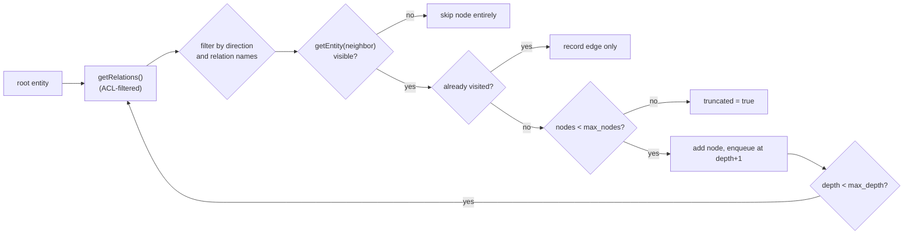

Traversal is cycle-safe (`visited` set), ACL-filtered at every hop, and bounded on
both depth and node count. An invisible neighbor is skipped rather than leaking its
existence, and the result reports `truncated` so the agent knows the rollup is
partial.

### 10.4 Pagination

Cursors are base64url-encoded `{"offset": N}`. Simple and honest about being
offset-based: stable for a given result set, not stable under concurrent writes.
A malformed cursor raises `Invalid cursor`.

---

## 11. Access control

### 11.1 Identity

A `ConsumerContext` is a set of principals plus a maximum clearance:

```typescript
interface ConsumerContext {
  principals: ReadonlySet<string>;  // "user:alice", "team:payments", "role:agent"
  clearance: "public" | "internal" | "confidential" | "restricted";
  system: boolean;                  // internal jobs; bypasses item ACLs, never tenant isolation
}
```

Principal strings are namespaced by convention (`user:`, `team:`, `role:`). The same
representation is used for `allow`/`deny` entries on an `AccessPolicy`, so matching is
exact set membership.

### 11.2 The decision

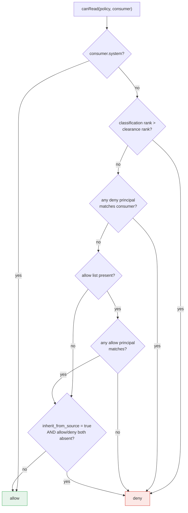

Three rules are worth restating because they are easy to get wrong:

1. **An explicit `deny` always wins**, even if the consumer also matches an `allow`.
2. **Missing `access` does not mean public.** An Observation with no `access` gets the
   default classification `internal`, which a `public`-clearance consumer cannot read.
3. **`inherit_from_source: true` without resolved `allow` or `deny` is fail-closed.**
   A Producer that claims to inherit an ACL but never resolved it denies everyone.

### 11.3 Where filtering happens

Filtering lives in `SensusStore`, adjacent to the SQL, not in `SensusWorld`. The
uniform pattern is: select rows, filter with `canReadObservation`, then map to output.
Keeping the check next to the query is what makes it hard to forget.

Consequences visible in the read model:

- **Field-level entity ACLs.** `getEntity` resolves each field's originating
  Observation via `field_sources_json` and includes the field only if that
  Observation is readable. An entity can be partially visible: you may see `name` but
  not `security_risk`. `updated_at` is recomputed over visible fields only, and an
  entity with no visible field at all returns `undefined` rather than an empty shell.
  A field with **no** recorded provenance is hidden rather than authorized by the
  entity's latest Observation. That is the fail-closed direction, and it matters on a
  database upgraded from before `field_sources_json` existed: those rows start with no
  provenance at all, and falling back to the latest Observation would authorize a field
  with an Observation that never carried its value. A source re-asserting the value
  records provenance again.
- **Signals inherit their evidence's restrictions.** A Signal is visible only if the
  consumer can read the Signal *and* every Observation in its evidence set. This is
  checked both when composing the policy and again at read time.
- **Evidence lookups are filtered too.** `findEvidence` skips Observations the
  consumer cannot read, so an unauthorized ref simply looks unresolvable.

### 11.4 Trust boundary

Tenant and identity are **never taken from tool arguments**.

On the **stdio** transport, identity is trusted process configuration:

| Setting | Source | Why |
| --- | --- | --- |
| Tenant | `SENSUS_TENANT_ID` env | Prevents an agent from selecting another tenant through tool input |
| Principals | `SENSUS_PRINCIPALS` env | Identity comes from the deployment, not the model |
| Clearance | `SENSUS_CLEARANCE` env | A ceiling the model cannot raise |

On the **Streamable HTTP** transport, every request is authorized separately by the
resolver named in `SENSUS_IDENTITY`. The resolved identity travels to the server factory
on the MCP SDK's pass-through `AuthInfo`, which is the only channel from per-request
authentication into the tool implementation — the handler itself performs no
verification.

Three rules the mapping layer enforces whatever the configuration says:

1. Clearance is capped by `clearance.ceiling`.
2. A tenant named by a token must appear in `tenant.allowed`, and the configuration is
   rejected at startup when the claim is set without the allowlist.
3. `system` is hardcoded to false, because it bypasses every item ACL.

Tenant pinning composes with identity. A deployment that sets `SENSUS_TENANT_ID` never
serves another tenant even if a token asserts one — that is `403 PERMISSION_DENIED`. With
the pin unset, each request's tenant comes from its validated token claim, which makes
`mapping.tenant.allowed` a security boundary rather than a convenience.

On the ingestion API, a tenant named by the request — the body on write routes,
`x-sensus-tenant` on read routes — is only honoured when nothing else determined one,
and only with `SENSUS_ALLOW_REQUEST_TENANT=true`. Otherwise the request is refused with
`403 PERMISSION_DENIED`. A caller-supplied tenant is vouched for by nothing, so
trusting it by default would let a single shared API key act on any tenant it can spell;
an unconfigured deployment fails closed instead of becoming an open multi-tenant writer.
Prefer letting the identity decide (`mapping.tenant.allowed`), and pin `SENSUS_TENANT_ID`
when one process serves one tenant.

### 11.5 Derived-data leakage

Protocol §14 requires that restricted evidence not leak through titles, descriptions,
dimensions, counts, or grouping keys. In v0.1 this is handled by visibility rather
than by aggregation coarsening: derived objects whose evidence is not fully readable
are hidden entirely. Tenant policy for coarsened or recalculated aggregates is not
implemented — see [§14](#14-known-limits).

---

## 12. Agent integration flow

The v0.1 operating model is a scheduled agent. Continuous perception happens in the
runtime; the schedule only decides when to spend model tokens.

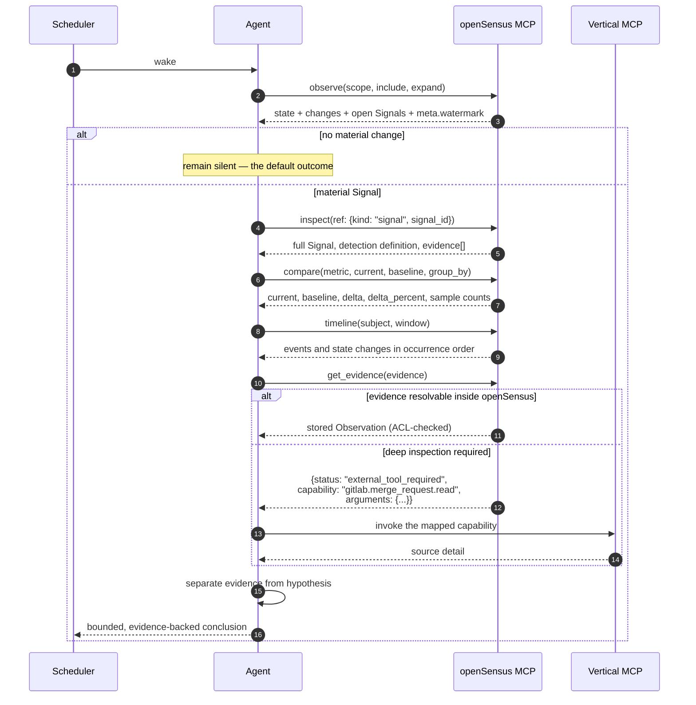

The evidence handoff is the key design decision. openSensus returns a **capability name**
(`gitlab.merge_request.read`), not a server or tool name, so the Agent Harness maps it
to whatever vertical MCP is installed. openSensus does not proxy credentials, and
protocol §5.3 forbids placing them in resolver arguments.

Signal-triggered wake-up is an optional extension. The protocol notes the trigger
payload should carry only the Signal ID, subject, severity, title, and connection
reference; the agent must re-read authorized detail through MCP rather than trusting
the payload as complete context.

---

## 13. Extension points

### Adding an Observation kind

1. Add the data schema and extend the discriminated union in `src/protocol.ts`.
2. Add a `project*` method in `src/store.ts` and a case in the `switch` inside
   `ingest`.
3. Add the same case to `rebuildSubject` so corrections still work — this is the step
   that is easy to miss.
4. Decide the merge discipline explicitly. Do not default to upsert.
5. Decide whether it feeds Signals, and whether it feeds `source_entities`.
6. Add the observation to the timeline's `kind IN (...)` filter if it belongs there.
7. Add a test that covers late arrival and correction for the new kind.

### Adding a detection method

`Signal.detection.method` already admits `statistical`, `model`, and `manual`, but
only `rule` is implemented. A new method needs: a place to evaluate it after
`projectMetric`, evidence collection, and a deterministic `signal_id` — the identity
scheme is what makes lifecycle management work, so it cannot be skipped.

### Swapping storage

All SQL is confined to `src/store.ts`. `SensusWorld`, `src/mcp.ts`, and `src/http.ts`
never see a query. A PostgreSQL backend means reimplementing `SensusStore`'s public
surface; the two behaviours to preserve are transactional projection (insert and
project atomically) and the replay ordering in [§6.5](#65-ordering-used-by-replay).

---

## 14. Known limits

These are real and worth knowing before deploying. The first three are properties of the
design rather than unfinished work.

| Limit | Detail | Consequence |
| --- | --- | --- |
| SQLite is single-writer | WAL mode, but one writer at a time | Ingestion throughput is serialized. Fine for connector workloads, not for high-volume streaming. PostgreSQL is the way past it |
| The backend cannot be switched live | `SENSUS_DATABASE_URL` is read once, at process start | Moving from SQLite to PostgreSQL means re-ingesting into the new backend; there is no in-place conversion |
| No schema migrations | Tables are created with `CREATE TABLE IF NOT EXISTS` on connect, and there is no version table | An upgrade that changes a column needs manual DDL. Back up first, and do not run an older binary against a newer schema |
| Long-tail identity providers are unsupported | `IdentityResolver` covers OIDC/JWT and shared API keys; Kerberos, mTLS and bespoke SSO are out of scope | A deployment with an unusual provider implements one `resolve()` method rather than waiting for support |
| stdio MCP is single-identity | The stdio transport carries no per-request credential | Multi-user deployments must use the Streamable HTTP MCP endpoint |
| Rule changes lose acknowledgement state | `reevaluateAllSignals` deletes and rebuilds all Signals for the tenant | A human `acknowledged` state does not survive a rule edit |
| Rule changes are O(series) | Full re-evaluation on every upsert/delete | Noticeable on tenants with many metric series |
| No source precedence for entity fields | `projectEntity` uses `occurred_at` with `<=`, so equal timestamps go to whichever wins the race | Protocol §7.4 requires the runtime to define source precedence per field; not yet implemented |
| Signals derive only from metrics | Detection runs in `projectMetric` | No detection path from events or state yet |
| Evidence lookup is a substring scan | `findEvidence` does `evidence_json LIKE '%ref%'` over the last 100 Observations | Not index-backed; needs an evidence index at scale |
| Some reads have scaling cliffs | `listEntities` caps at 1000 rows before ACL filtering; `getRecentMetricChanges` issues one query per series, and so does `canReadObservation` on PostgreSQL — one query per row | Fine at MVP scale, degrades on large tenants |
| `watermark` is a bounded scan | `latestWatermark` looks at the newest 1000 Observations and reports the newest readable one among them | A principal cleared for none of that window sees the epoch, which reads as "nothing happened" rather than "not cleared". An ACL-aware query would fix it |
| PostgreSQL write paths can deadlock in one direction | An ingest holds the per-subject advisory lock and then touches the syncs row, while `completeSync` holds the syncs row and then ingests. PostgreSQL aborts one side with `40P01`, surfaced as a 500 | Only when ingestion races a completion into the same open sync. Nothing retries; the caller does |
| No push or subscription | Agents poll via the schedule | Intentional for v0.1; protocol §19 defers push delivery |
| The batch endpoint is sequential | Items are processed one at a time, so a full 1000-item batch takes roughly four seconds at the measured single-writer rate. Items are independent, so bounded concurrency across subjects would be safe — the projection locks already serialize the cases that need it | Large batches are slower than the backend can actually go. Numbers in [§6](#6-write-path) |
| Concurrency is scoped, not global | Writes serialize per subject on PostgreSQL ([§6.6](#66-concurrency)) | Two writers touching the same subject queue behind each other. Sizing a multi-writer deployment means measuring that, not just connection count |

Protocol §19 lists the broader deferred set: canonical cross-source entity merge, a
rule DSL, natural-language queries, subscriptions, automatic action execution,
federated runtime discovery, full bitemporal correction semantics, and vector search.

---

## 15. Conformance

The protocol defines conformance for three roles in
[§17](sensus-protocol-v0.1.md):

- **Producer** — stable idempotent Observation IDs, valid timestamps, namespaced
  source identifiers, retry without payload mutation, preserved access metadata.
- **Runtime** — validate and durably store, implement idempotency and conflict,
  materialize all six projections, preserve provenance, expose all six MCP tools,
  return watermarks, enforce authorization.
- **MCP server** — authenticate a Consumer principal, keep tenant selection outside
  model-generated arguments, expose read-only tools, bound and paginate, return
  evidence for derived claims, avoid leaking credentials or inaccessible content.

[§18](sensus-protocol-v0.1.md) defines the reference end-to-end flow that this
implementation is built to satisfy, from a GitLab review-request webhook through to
an agent reporting a bounded, evidence-backed conclusion.
