# openSensus 架构说明

[English](architecture.md) | [简体中文](architecture.zh-CN.md)

本文说明 openSensus Runtime 的组成结构，以及为什么这样设计。面向希望部署、扩展或
fork 本项目的读者。

规范性的接口契约请阅读 [协议规范](sensus-protocol-v0.1.md)。接入系统的具体步骤
请阅读[接入文档](integration-guide.zh-CN.md)。

> 说明：协议规范文档（`sensus-protocol-v0.1.md`）为规范性文件，目前仅提供英文版本，
> 以保证契约表述的唯一性。本文与《接入文档》提供中英双语。

---

## 1. openSensus 是什么

openSensus 是**面向 AI Agent 的感知层**。企业系统提交只追加（append-only）的
Observation，Runtime 将其投影为当前状态、检测有证据支撑的 Signal，并通过 MCP
暴露一个带上限、按权限过滤的世界视图。

两条边界定义了产品：

- **openSensus 不是行动协议。** Agent 用 openSensus 理解世界，用其他工具改变世界。v0.1
  的所有 MCP 工具都是只读的。
- **openSensus 不替代特定数据源的 MCP Server。** 它只报告*去哪里看*以及*为什么值得
  看*，深度排查交给垂直 MCP。openSensus 从不代理源系统凭据，也从不执行源系统动作。

它解决的问题很具体：把 N 个企业 MCP 直接交给 Agent，Agent 既不知道什么变了，又
要耗尽上下文去发现这件事。openSensus 把发现成本压到数据库里——持续感知由 SQL 完成，
只有当确实发生实质性变化时，才消耗模型的 token。

### 系统上下文

```mermaid
flowchart LR
    subgraph SRC["企业系统"]
        GL["GitLab"]
        JI["Jira"]
        OT["CRM / ERP / HRIS"]
    end

    subgraph PROD["Producer 采集端"]
        WH["Webhook 处理器"]
        PO["轮询 Connector"]
        BA["CDC / 批量导入"]
    end

    RT["<b>openSensus Runtime</b><br/>只追加 Observation<br/>世界投影<br/>指标与 Signal"]

    AG["<b>Agent Harness</b><br/>定时 / 信号触发"]

    VM["<b>垂直 MCP Server</b><br/>GitLab MCP、Jira MCP ..."]

    SRC --> PROD
    PROD -->|"Observation API<br/>HTTP，只追加"| RT
    RT -->|"openSensus MCP<br/>6 个只读工具"| AG
    AG -->|"能力提示<br/>如 gitlab.merge_request.read"| VM
    VM -->|"深度排查与执行动作"| SRC

    style RT fill:#e8f0fe,stroke:#4285f4,stroke-width:2px
    style AG fill:#fef7e0,stroke:#f9ab00
    style VM fill:#f1f3f4,stroke:#5f6368
```

### 工作原理

Runtime 只做一件事：把一串事实变成可查询、按权限过滤的世界视图。

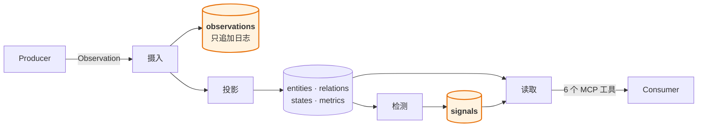

**核心思想：日志是唯一的事实来源，其余每一张表都只是缓存。**

Observation 只追加、永不修改。其他任何东西都不是权威的——`entities`、`relations`、
`states`、`metrics`、`signals` 全部**派生**自这份日志，且全部可以被丢弃并重算。

设计中的其余部分几乎都是从这一条性质推出来的：

- **修正一条错误事实**，是把日志里那条标记为作废，然后重放该 subject。
- **快照里不再包含某条记录**，会变成一条合成的日志条目，而不是静默删除。
- **修改一条检测规则**，是清空 Signal 索引，再从日志里的指标重算。

这些都不需要各自专用的机制，因为它们都不是特例：它们全都是**丢弃投影、重放日志**。

在进入细节之前，有三条性质值得先知道：

- **读与写永远一致。** 投影与追加在同一个事务内完成，因此读永远不会看到"有事实但没有
  投影"的状态。
- **答案自带证据。** 每个派生值都指出它来自哪些 Observation，而一条 Signal 只对能读遍它
  全部证据的调用方可见。
- **每次读取都是有界的。** 上限、深度封顶和 `truncated` 标志是构造上强制的，因为这些答案
  的归宿是模型的上下文窗口。

### 深入阅读

| 问题 | 章节 |
| --- | --- |
| 有哪些组成部分，哪个是待改造的？ | [§3 模块地图](#3-模块地图) |
| 为什么有一张表和另外九张不一样？ | [§5 日志与投影](#5-日志与投影) |
| 一条 Observation 经历了什么？ | [§6 写入路径](#6-写入路径) |
| 修正与快照到底怎么运作？ | [§7](#7-修正与确定性重放) · [§8](#8-快照对账) |
| Signal 是怎么产生的，为什么不做成 DSL？ | [§9 Signal 检测](#9-signal-检测) |
| 权限是怎么执行的，派生数据上呢？ | [§11 访问控制](#11-访问控制) |
| Agent 实际看到的是什么？ | [§12 Agent 接入流程](#12-agent-接入流程) |
| 还有什么不能用？ | [§14 已知限制](#14-已知限制) |

---

---

## 2. 设计原则

有九条原则主导了绝大多数实现决策。前八条是协议中的规范性要求
（[§4](sensus-protocol-v0.1.md)），第九条是架构层面的。

| # | 原则 | 体现位置 |
| --- | --- | --- |
| 1 | Observation 只追加，不可变更 | `observations.payload_json` 只写一次；修正通过新增行表达 |
| 2 | 当前状态是投影，不是历史的事实来源 | 除 `observations` 外所有表都可删除重建 |
| 3 | 每个派生值都必须可追溯到证据 | `signals.evidence` + 检测时冻结的 `detection.definition` |
| 4 | 源发生时间与观测时间必须区分 | `occurred_at` / `observed_at` / `received_at` |
| 5 | Producer 可以提交不完整的信息 | `entity.observed` 是局部补丁；字段缺失表示未知而非删除 |
| 6 | 未知类型与字段必须保留 | 不强制本体论；`attributes_json` 自由结构 |
| 7 | 读取必须按调用方 Consumer 身份过滤 | 过滤在 `SensusStore` 内、紧贴 SQL 处完成 |
| 8 | v0.1 的 MCP 工具必须只读 | `src/mcp.ts` 未注册任何写操作 |
| 9 | 派生推理不被静默改写 | 规则变更会重建 Signal，但历史检测描述保留 |

第 2 条是承重墙，详见 [§5](#5-日志与投影)。

---

## 3. 模块地图

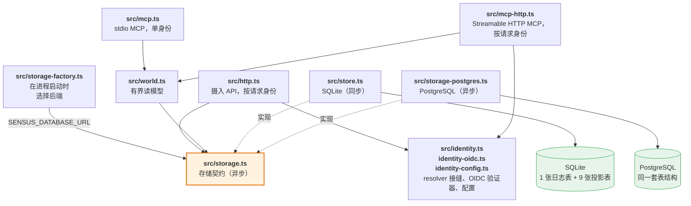

`SensusWorld` 与摄入 API 依赖的是**契约**，而不是任何具体后端。工厂在启动时解析一次这个
依赖，因此其他模块都不知道背后是哪一种数据库。

| 模块 | 职责 |
| --- | --- |
| `src/protocol.ts` | 类型契约。`EntityRef`、`SourceRef`、`EvidenceRef`、`AccessPolicy`、五种 Observation 与 `Signal` 的 zod schema，以及 `canonicalJson` / `contentHash` / `stableId` 工具函数。 |
| `src/store.ts` | SQLite 实现。摄入、幂等、按类型的投影、修正与重放、快照对账、规则存储与 Signal 求值，以及全部带 ACL 的读取。 |
| `src/storage.ts` | 与后端无关的存储契约，以及任何实现都必须守住的两条不变量。 |
| `src/storage-sqlite.ts` | 把同步的 SQLite 存储适配到契约上，使两个后端能被同一套一致性测试约束。 |
| `src/storage-postgres.ts` | 同一契约的 PostgreSQL 实现。 |
| `src/storage-factory.ts` | 在进程启动时按 `SENSUS_DATABASE_URL` 选择后端，并在日志中隐去连接串里的密码。 |
| `src/world.ts` | 有界读模型。六个工具的输入 schema 与实现、图遍历编排、指标聚合、游标编解码。 |
| `src/mcp.ts` | stdio MCP 的工具注册与进程启动。 |
| `src/mcp-http.ts` | MCP over Streamable HTTP。按请求解析身份，并按请求构造 `SensusWorld`，这正是让一个端点服务多个身份的关键。 |
| `src/node-http.ts` | 把基于 fetch 的 MCP handler 桥接到 Node 的 `http` 服务上。 |
| `src/access.ts` | `ConsumerContext`、`canRead` 判定、策略合成（`combinePolicies`）。 |
| `src/identity.ts` | `IdentityResolver` 接缝、声明式 claim 映射，以及 API Key 与匿名 resolver。 |
| `src/identity-oidc.ts` | OIDC/JWT 验证器：discovery、JWKS 缓存、非对称算法白名单。 |
| `src/identity-config.ts` | 加载 `SENSUS_IDENTITY` 指向的 JSON 身份配置。 |
| `src/signal-rules.ts` | `SignalRule` schema、`ruleApplies` 匹配、两种条件的 `evaluateRule`，以及内置默认规则。 |
| `src/http.ts` | 摄入 API。路由、身份、租户解析、请求体大小限制、协议错误响应。 |

**没有异步 worker、没有消息队列、没有后台调度器。** 投影与插入在同一个事务中同步完成。

这是一个刻意的**一致性**选择，而不是能力不足，值得把它的收益说清楚：

- 读永远不会看到"投影尚未应用"的 Observation，因此没有任何读路径需要处理"pending"状态。
- 幂等变得平凡：日志行与它的投影一起提交，重试要么两者都看到，要么两者都看不到。
- 失败在请求上暴露。格式错误的修正是一个 `409`，而不是没人盯的死信队列里的一条消息。
- 没有需要运维、监控、备份的消息中间件——这对一个要能自托管的产品很重要。

协议本身是**允许**另一种做法的。[§10](sensus-protocol-v0.1.md) 明确写着"投影处理允许滞后
于摄入"，只要求读响应暴露 watermark。本实现选择了更强的保证，同时仍然报告 watermark。

代价是吞吐，而这个代价的大小是可以度量的，不必凭感觉。在单机 PostgreSQL 上、连接池已
预热的情况下：

| 工作负载 | 吞吐 |
| --- | --- |
| 串行，任意类型 | ~235 obs/s |
| 16 路并发，**不同** subject | ~900 obs/s（3.7–4.1×）|
| 16 路并发，**同一** subject | ~375 obs/s |

由此得到两点。信号评估与普通投影一样能随并发扩展，因此它不是一个隐藏的串行点。真正的
天花板是**按 subject 的争用**（[§6.6](#66-并发)），而不是同步模型——单个实体无论并发多高
都吃不下一秒几百次以上的更新。对 Connector 类负载（webhook、轮询、CDC）而言，这是几个
数量级的余量。

这个设计真正付出代价的地方是批量端点，它逐条处理（[§14](#14-已知限制)）。

---

## 4. 分层与依赖方向

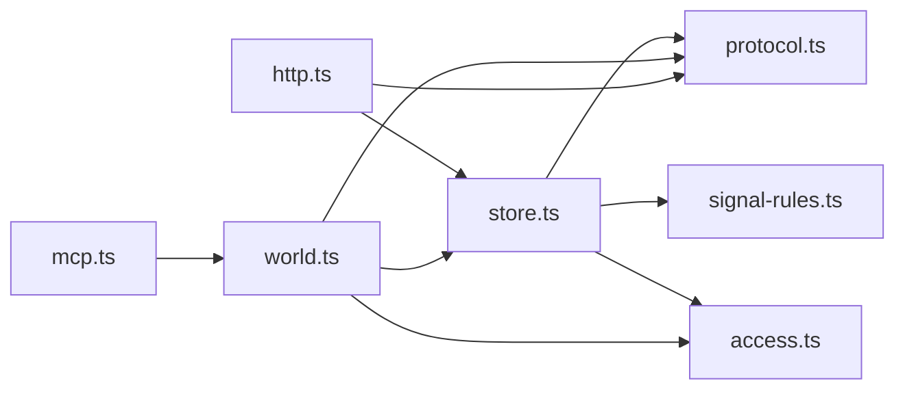

依赖方向全部指向 `protocol.ts`。`store.ts` 不知道 HTTP 与 MCP 的存在；`world.ts`
不知道传输层的存在。两个入口（`http.ts`、`mcp.ts`）是唯一接触外部世界的模块，
且都只是薄适配层。

对贡献者的实际影响：`SensusWorld` 与 `SensusStore` 都是可直接构造的普通类，测试
可以绕过服务端直接驱动它们。本项目的测试正是如此——存储与投影行为直接测，只有
HTTP 与 MCP 测试才真正启动传输层。

---

## 5. 日志与投影

这是架构的核心。`observations` 是只追加日志，也是唯一的事实来源。其他所有表都是
**可从日志删除并重建的派生投影**。

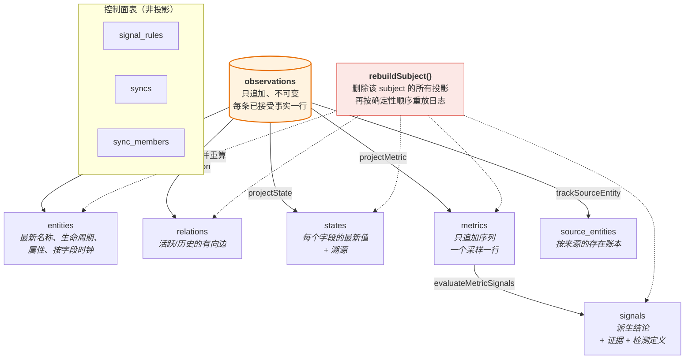

三个彼此独立的需求，靠这一条性质同时满足：

1. **修正**——作废一条 Observation 需要重算它下游的一切（[§7](#7-修正与确定性重放)）。
2. **对账**——删除一个实体不能让它关联的 relation、state、metric、Signal 变成孤岛
   （[§8](#8-快照对账)）。
3. **规则变更**——修改检测规则必须重新评估已有的指标序列（[§9](#9-signal-检测)）。

三者都以「丢弃投影 + 重放」实现。代码里**不存在任何增量修补逻辑**，这也是代码量
能保持较小的原因。

### 数据库结构

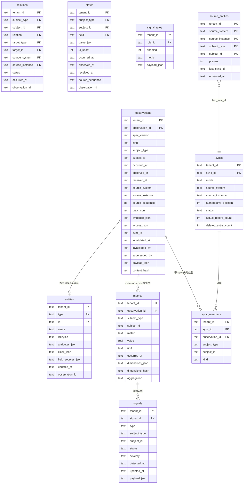

每张投影表的主键都包含 `tenant_id`，因此租户隔离是**存储层不变量**，而不是查询时的
过滤条件。日志与投影之间没有 SQL 外键：关系由 `project*` 方法维护，完整性靠重放
恢复，而不是靠级联删除。

`access_json` **只存在于 `observations` 上**。投影表记录产生它的 `observation_id`，
在读取时重新解析策略。这意味着修改访问策略需要先删除再重新摄入，也解释了为什么
`store.ts` 里的过滤辅助函数总要回查原始 Observation。

---

## 6. 写入路径

### 6.1 摄入流程

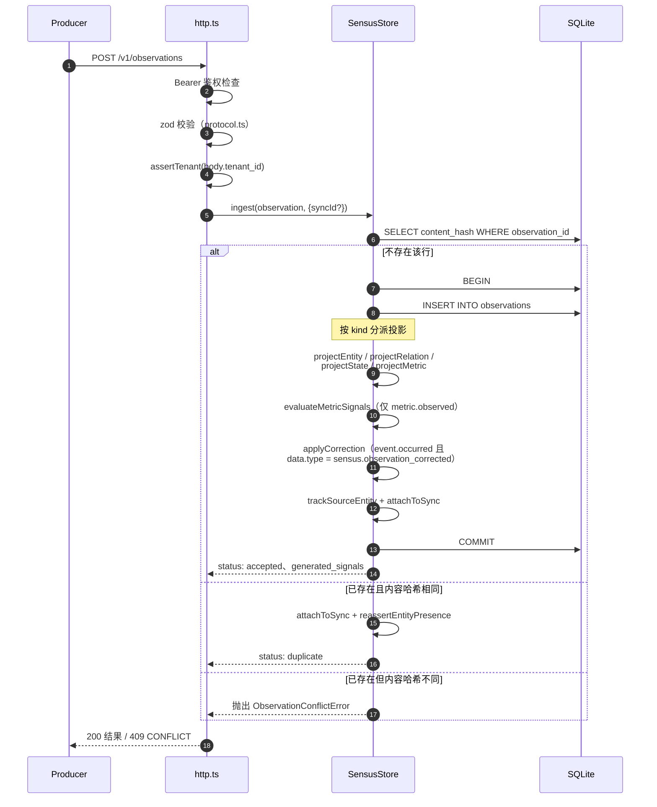

一条 Observation 的全部投影工作在一个事务内完成。任何一步抛错——格式错误的修正、
sync 来源不匹配——插入都会回滚，不会留下半成品投影。

### 6.2 幂等与冲突

`observation_id` 在租户内唯一。Runtime 保存载荷的 SHA-256 哈希，哈希基于
**规范化 JSON**（`canonicalJson` 递归排序对象键），因此同一条事实的两种键序序列化
不会被误判为冲突。

| 输入 | 条件 | 结果 |
| --- | --- | --- |
| 相同 `observation_id` | 规范化哈希一致 | `status: "duplicate"`，HTTP 200，不做投影 |
| 相同 `observation_id` | 规范化哈希不一致 | `ObservationConflictError`，HTTP 409 |
| 新 `observation_id` | — | `status: "accepted"`，执行投影 |

带 `Sensus-Sync-Id` 头时，重复路径**不是**空操作：它仍会把 Observation 挂载到本次
sync，并可能触发存在性复断言。这正是「整份快照重发一遍」能作为合法对账策略的原因，
详见 [§8](#8-快照对账)。

### 6.3 三种时钟

| 字段 | 赋值方 | 含义 | 可变 |
| --- | --- | --- | --- |
| `occurred_at` | Producer | 事实在源世界何时为真 | 否，属于载荷 |
| `observed_at` | Producer | Producer 何时看到或提取到它 | 否，属于载荷 |
| `received_at` | Runtime | openSensus 何时接受它 | 否，插入时赋值一次 |

所有排序与新鲜度判断都以 `occurred_at` 为准；`received_at` 是最后的兜底比较项，也是
读取元数据中 `watermark` 的来源。把两者分开，才使得迟到的 Observation 能被放回
时间线上的正确位置，而不是被当成新事件处理。

Producer 提供的时刻在入口处一律规范化为 UTC，并带上毫秒。协议接受任何 RFC 3339 偏移
量，但这里所有比较——按字段的时钟、重放顺序、`ORDER BY occurred_at`——都是按字符串比较
存储值，而 `2026-01-01T10:00:00+02:00` 虽然时刻更早，却不会排在
`2026-01-01T09:00:00Z` 之前。统一成一种形态，字符串比较才等价于时刻比较。这带来两个
可见结果：Producer 无法通过切换偏移量影响任何排序；用不同偏移量重发同一时刻会被判为
重复而不是冲突。

### 6.4 按类型的投影语义

每种 Observation 有不同的合并纪律。这是设计中最刻意的部分——**不是统一的 upsert**。

| Kind | 投影目标 | 合并规则 | 理由 |
| --- | --- | --- | --- |
| `entity.observed` | `entities` | 按字段的 LWW，时钟记录在 `clock_json` | 多个 Producer 可能描述同一实体的不同属性；局部补丁不得抹掉它未提及的字段 |
| `relation.observed` | `relations` | 按元组 `(tenant, subject, relation, target, source)` 做 LWW，并用 `occurred_at` 守卫 | 关系身份包含来源，因此两个系统可以对同一条边持不同看法而不互相覆盖 |
| `state.observed` | `states` | 按 `(occurred_at, source_sequence, received_at)` 做 LWW，**迟到数据绝不覆盖新状态** | 状态是每字段单值，迟到的观测不能把它回滚 |
| `metric.observed` | `metrics` | 纯追加；主键为 `observation_id` | 指标是序列而非单值，合并会破坏历史 |
| `event.occurred` | 仅 `observations` | 从不修改投影；当 `data.type` 为 `sensus.observation_corrected` 时额外被解释为修正指令 | 事件是时间线事实 |

`entity.observed` 这一行值得展开。`field_sources_json` 记录**每个字段由哪条
Observation 写入**：

```jsonc
// entities.clock_json          - 每个字段最后被写入的时间
{ "name": "2026-09-15T09:00:00Z", "attribute:security_risk": "2026-09-16T11:00:00Z" }

// entities.field_sources_json  - 由哪条 Observation 写入
{ "name": "obs_change", "attribute:security_risk": "obs_change_secret" }
```

这一份映射同时支撑了两个特性：按字段的冲突消解，以及按字段的访问控制
（[§11](#11-访问控制)）。

### 6.5 重放使用的排序

投影重建时，同一 subject 的 Observation 按以下全序重放；这也是 `state.observed`
使用的比较顺序：

```sql
ORDER BY occurred_at ASC,
         COALESCE(source_sequence, -1) ASC,
         received_at ASC,
         observation_id ASC
```

先按 `occurred_at`，其次在 Producer 提供时用源系统自己的序号，再按接收顺序，最后以
`observation_id` 作为确定性兜底，确保同一份日志重放两次产生完全一致的投影。

### 6.6 并发

`projectEntity` 与 `projectState` 是"读当前行 → 在 JavaScript 里合并 → 写回"。两个写入者
同时这么做会丢掉其中一次更新，因此 PostgreSQL 后端按 subject 用事务级 advisory lock 串行化
投影工作：

```sql
SELECT pg_advisory_xact_lock(hashtext($tenant), hashtext($subject))
```

锁持有到事务结束，因此同一 subject 的"读-合并-写"是原子的，而不同 subject 之间完全并发。
**按 subject 是恰当的粒度**，因为它正好是投影逻辑假定的单位：除了 `reevaluateAllSignals`
和 对账清扫，没有任何投影会跨 subject 读取——而这两个要么是自愈的（下一个采样会重算
Signal），要么已经由 `SELECT ... FOR UPDATE` 保护。

有两个竞态交给主键仲裁而不是加锁，因为"先查后写"会让两个调用方都通过检查：

| 竞态 | 仲裁方式 |
| --- | --- |
| 两个写入者插入同一个 `observation_id` | observations 的主键。败者捕获 `23505`、重试、走 duplicate 路径——因此它看到的是 duplicate 或 conflict，而绝不是驱动层错误 |
| 两个写入者开启同一个 `sync_id` | syncs 的主键。败者得到 `SyncError` |

SQLite 完全不需要这些：同一时刻一个写入者，是比按 subject 加锁更强的保证。`busy_timeout`
让第二个进程等待锁，而不是立刻以 `SQLITE_BUSY` 失败。

[`test/conformance.ts`](../test/conformance.ts) 用这些行为约束两个后端。有两个细节让这些
用例是真的而非装饰：它们只对连接池后端运行，因为单连接的 SQLite 不可能重叠、会空转通过；
并且它们会先预热连接池，因为连接池是懒创建的，未预热的一批并行调用会被建连接的延迟错开，
根本不会真正竞争。

---

## 7. 修正与确定性重放

Producer 会出错。openSensus 从不修改已接受的 Observation，而是把修正本身作为一条携带
控制消息的 `event.occurred` Observation。

```json
{
  "kind": "event.occurred",
  "subject": { "type": "software.change", "id": "gitlab:acme/payments-api!3812" },
  "data": {
    "type": "sensus.observation_corrected",
    "attributes": {
      "target_observation_id": "obs_01K57YB5WVEQNHQN2SMQEZHZZF",
      "disposition": "invalid",
      "replacement_observation_id": "obs_01K57YNEW8BT4VNJ9VN6HK5FQK"
    }
  }
}
```

`disposition` 取值 `invalid` 或 `superseded`。目标行会被打标（`invalidated_at`、
`invalidated_by`、`superseded_by`），但**永不删除**——它保留在日志中供审计，只是从
投影和授权读取中消失。

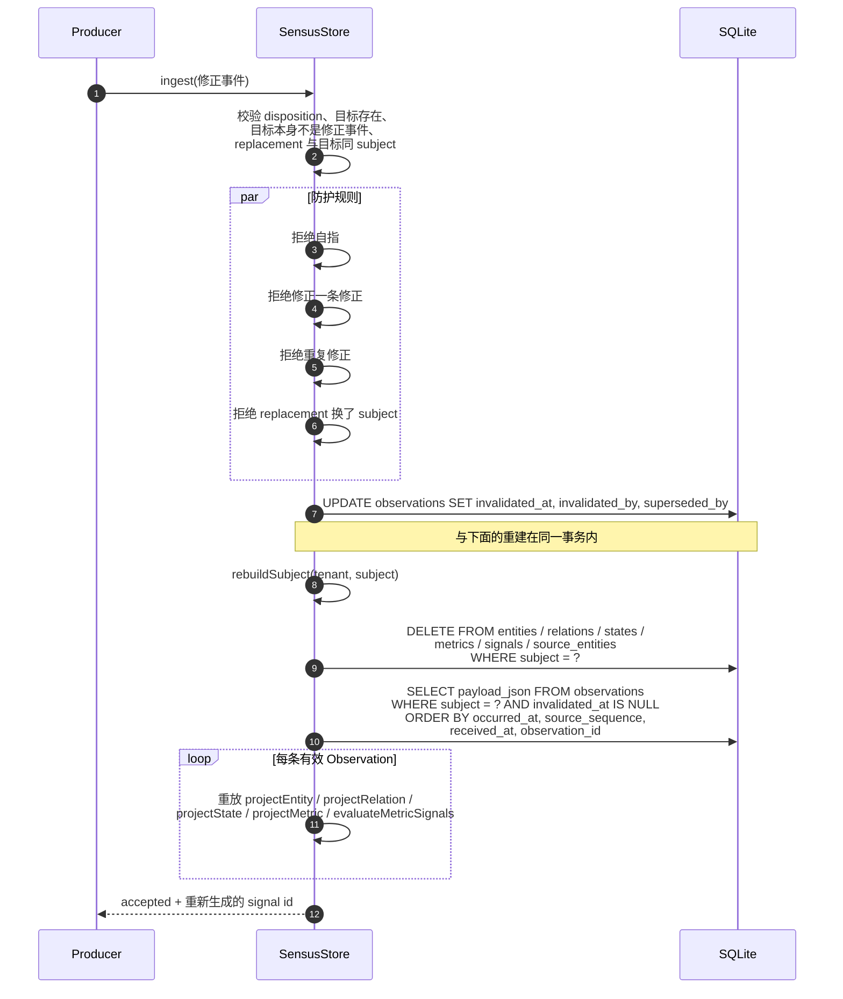

打标与全量重建在**同一个事务**内执行，因此读者永远不会看到重建到一半的 subject。
重建同时会重跑 Signal 检测，所以一次修正可能顺带创建或解决 Signal。

写入前强制校验的约束（见 `src/store.ts` 的 `applyCorrection`）：

- `target_observation_id` 必须在同租户内存在
- `disposition` 必须恰好是 `invalid` 或 `superseded`
- Observation 不能修正自己
- 修正事件不能以另一条修正事件为目标
- 同一目标不能被不同的修正重复修正
- replacement 必须与目标描述同一个 subject

---

## 8. 快照对账

事件投递是有损的，而且系统里本来就有早于 openSensus 存在的数据。因此合规的 Producer 会
周期性地发送全量快照，而 Runtime 必须能够安全地得出「这条记录已经不存在了」。

难点在于：仅凭「存在的记录列表」无法推断缺失；而且绝不能让某一个来源删掉另一个来源
仍在报告的实体。openSensus 用一张**按来源的存在账本**来解决。

### 存在账本

`source_entities` 为每个 `(tenant, source, entity)` 保存一行，带有 `present` 标志和
断言它的 `last_sync_id`。只有 `entity.observed` 会写入这张表。

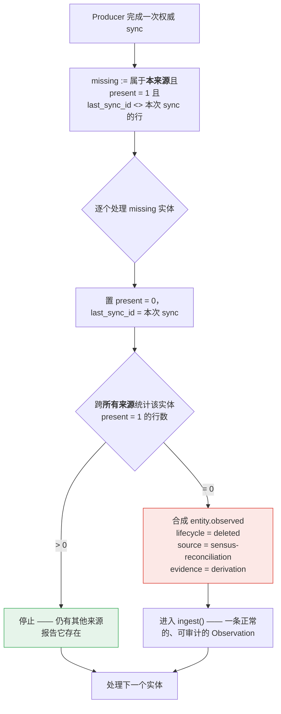

由此得到两个性质：

- **删除是保守的。** 只有当已完成的快照是权威的，*并且*没有其他来源仍报告该实体
  存在时，才标记为已删除。
- **删除是可审计的。** 它是一条合成的 Observation，证据类型为 `derivation` 并指向
  该 sync，而不是静默的 `UPDATE` 或 `DELETE`。它走常规摄入路径，因此像其他事实一样
  被投影、求值、读回。

### 完整对账时序

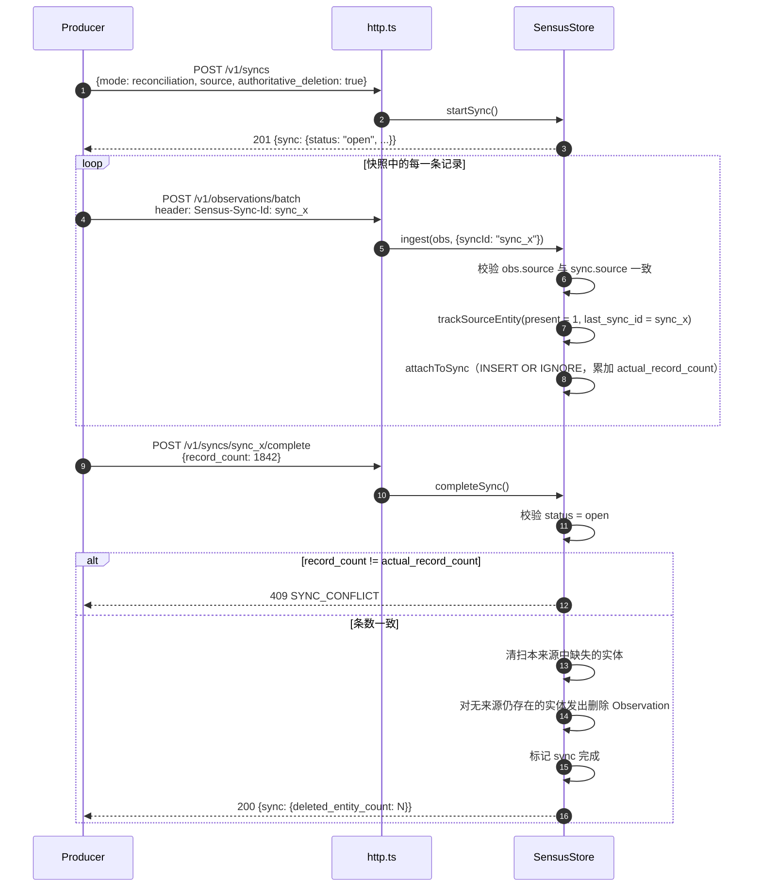

条数校验很重要。没有它，一份被截断或部分失败的快照会看起来像一个「合理地变小了的
世界」，从而批量删除仍然存活的实体。要求 Producer 声称的 `record_count` 等于幂等
挂载的成员数，把这种故障模式变成了显式的 `409`。

### 记录复活

如果先前被删除的记录重新出现，投影会被恢复——而且恢复动作同样是一条 Observation。
当重发的快照 Observation 作为幂等重复进入一个新的 sync 时，
`reassertEntityPresence` 会检查当前投影是否为 `lifecycle = "deleted"`。若是，则合成
一条 `occurred_at = now` 的 `authoritative-presence` Observation；它的时间晚于删除，
因此会胜出。

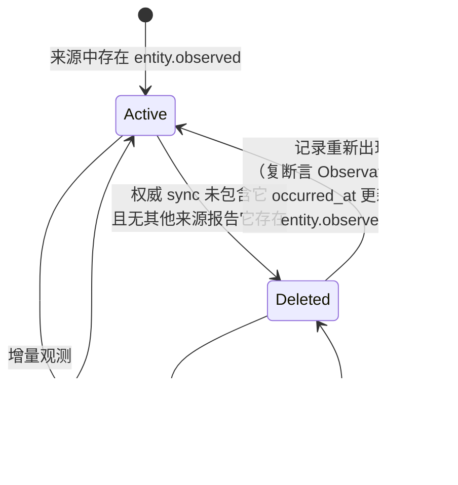

---

## 9. Signal 检测

Signal 是 Runtime 给出的「某项变化值得关注」的结论。它明确**不是**输入事实，MCP
Server 的 instructions 也要求 Agent 把 Signal 视为派生结论并通过证据验证。

### 规则模型

v0.1 用两种结构化条件替代通用表达式语言。这是刻意的范围限制
（[协议 §19](sensus-protocol-v0.1.md)）：在参考实现产出「确有必要」的证据之前，
不引入 DSL。

| 条件 | 字段 | 触发条件 |
| --- | --- | --- |
| `threshold` | `operator`（gt/gte/lt/lte）、`value`、`for_samples` | 最近 `for_samples` 个采样全部满足比较 |
| `relative_change` | `direction`（increase/decrease）、`threshold_percent`、`minimum_baseline`、`for_samples` | 最近 `for_samples` 次相邻采样的变化幅度全部超过百分比阈值 |

两者都要求**连续**命中。对 `relative_change` 而言，N 次连续的*变化*需要 N+1 个
*采样*，这也是求值时取 `for_samples + 1` 个点的原因。

规则按租户存于 `signal_rules`，由 `ruleApplies` 匹配，检查指标名（支持 `*` 通配）、
可选的 `subject_types`，以及维度的子集匹配。若租户完全没有规则，则使用内置默认规则
`metric.significant_increase`——相对增幅 50%，`warning` 级别。

### Signal 身份让生命周期成立

Signal ID 是确定性哈希，而非随机 UUID：

```text
stableId("sig", tenant_id, rule_id, subject_type, subject_id, metric, dimensions_hash)
```

因为身份按 (规则, 序列) 稳定，重新评估同一序列会**更新同一个 Signal**，而不是每次
评估都新建一个。没有这一点，`open → resolved` 的状态迁移就失去意义。

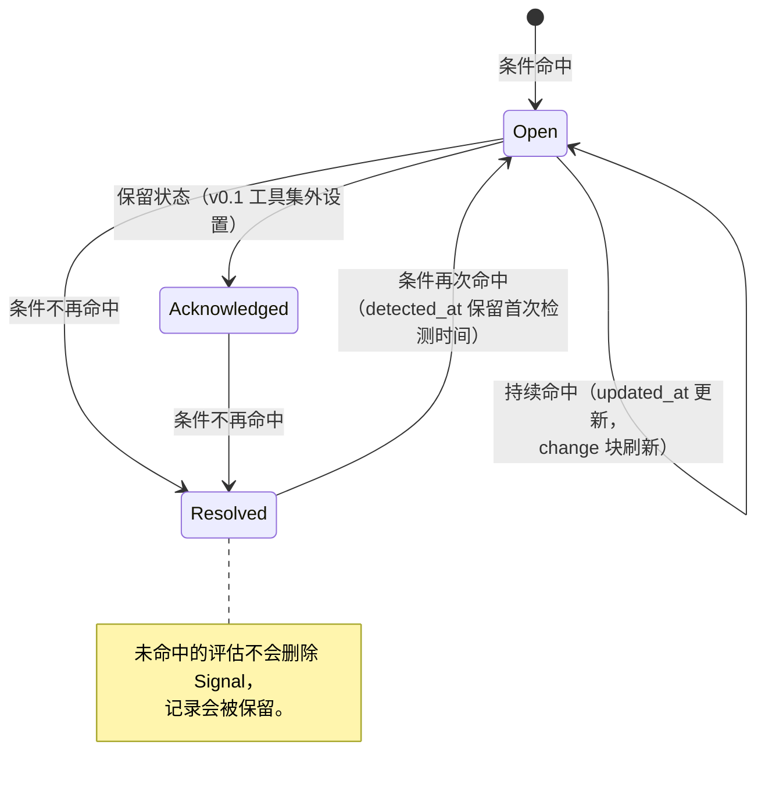

### 规则变更会重建 Signal 索引

修改或删除规则不能留下过时的结论。两个操作都会调用 `reevaluateAllSignals`：

1. 删除该租户的全部 Signal；
2. 用窗口函数从观测日志中按
   `(subject_type, subject_id, metric, dimensions_hash)` 选出最新且**有效**的采样
   （排除 `invalidated_at IS NOT NULL`）；
3. 从这些采样逐个重放检测。

这是「投影可重建」这一性质第三次被复用。它同时也意味着规则变更的代价是
O(不同序列数)——详见 [§14](#14-已知限制)。

规则求值还会合成权限：Signal 的 `access` 取其证据 Observation 策略的**交集**
（`combinePolicies`），且 `canReadSignal` 在读取时还会逐条复查证据引用。

---

## 10. 读取路径

### 10.1 六个工具

`SensusWorld` 实现六个只读工具，每个都有 zod 输入 schema，MCP 层在注册工具时复用
它们。主入口是 `observe`。

| 工具 | 用途 | 主要上限 |
| --- | --- | --- |
| `observe` | 某个 scope 的有界首视图：状态、近期指标变化、未解决 Signal。可选展开关系图。 | `limit` ≤ 200、`max_depth` ≤ 5、`max_nodes` ≤ 500、`relations` ≤ 50 |
| `inspect` | 单个实体或单个 Signal 的详情。 | `include` 取 state/relations/metrics/evidence 的子集 |
| `timeline` | 按发生时间排序的事件与状态变更。 | `limit` ≤ 200，游标分页，内部扫描上限 10,000 行 |
| `query` | 对实体或 Signal 做结构化谓词过滤。 | `limit` ≤ 200，游标分页 |
| `compare` | 单个指标在两个窗口间比较，可选分组。 | `limit` ≤ 200，`group_by` ≤ 5 |
| `get_evidence` | 解析一条证据引用，或返回所需的垂直 MCP 能力。 | 单条引用 |

### 10.2 一切都有上界

协议要求 `observe` "MUST NOT dump the entire underlying event stream into the Agent
context"（不得把底层事件流整体倾倒进 Agent 上下文）。这条约束是机械性强制执行的：

- 每个工具都声明 `limit` 且带硬上限；
- 图遍历同时有深度预算和节点预算；
- `timeline` 单次调用最多扫描 10,000 行 Observation；
- 每个响应都带 `meta.truncated`，还有更多数据时带 `meta.next_cursor`。

响应还会带 `meta.watermark`，即调用方主体可见的最新 `received_at`。这让 Agent 能区分
「什么都没发生」和「这个视图是旧的」。

```json
{
  "meta": {
    "request_id": "req_...",
    "tenant_id": "acme",
    "as_of": "2026-09-16T10:06:00Z",
    "watermark": "2026-09-16T10:05:52Z",
    "truncated": false
  }
}
```

### 10.3 图展开

`observe.expand` 从 scope 实体出发做广度优先遍历：

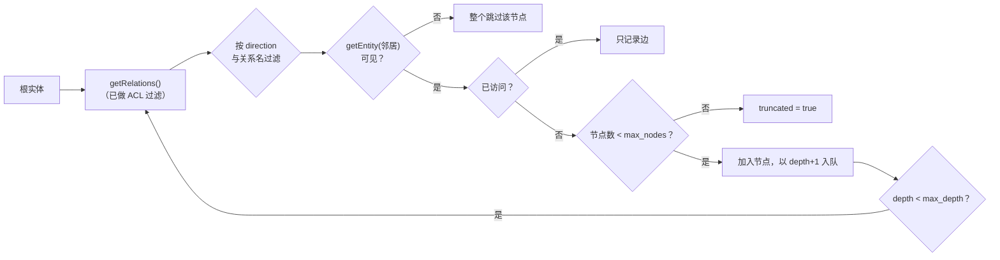

遍历防环（`visited` 集合）、逐跳做 ACL 过滤、深度与节点数双重封顶。不可见的邻居会被
整体跳过而不是泄露其存在；结果会报告 `truncated`，让 Agent 知道这次汇总是不完整的。

### 10.4 分页

游标是 base64url 编码的 `{"offset": N}`。简单直接，也如实反映它是基于偏移量的：
对固定结果集稳定，在并发写入下不稳定。格式非法的游标会抛出 `Invalid cursor`。

---

## 11. 访问控制

### 11.1 身份

`ConsumerContext` 是一组 principal 加上一个最大密级：

```typescript
interface ConsumerContext {
  principals: ReadonlySet<string>;  // "user:alice"、"team:payments"、"role:agent"
  clearance: "public" | "internal" | "confidential" | "restricted";
  system: boolean;                  // 内部任务；绕过条目 ACL，但绝不绕过租户隔离
}
```

principal 字符串按约定带命名空间（`user:`、`team:`、`role:`）。`AccessPolicy` 上的
`allow`/`deny` 使用同一表示，因此匹配就是精确的集合成员判断。

### 11.2 判定流程

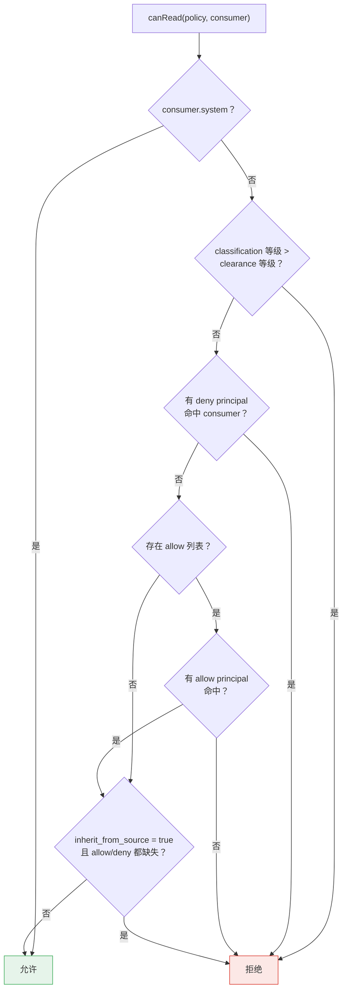

有三条规则值得重述，因为它们很容易被误解：

1. **显式 `deny` 永远优先**，即使 consumer 同时命中某个 `allow`。
2. **缺少 `access` 不等于公开。** 没有 `access` 的 Observation 取默认密级
   `internal`，`public` 密级的 consumer 读不到它。
3. **`inherit_from_source: true` 而 allow/deny 未解析时是 fail-closed 的。** Producer
   声称继承来源 ACL 却从未解析，结果是拒绝所有人。

### 11.3 过滤发生的位置

过滤位于 `SensusStore` 内、紧贴 SQL，而不是在 `SensusWorld`。统一模式是：查出行、
用 `canReadObservation` 过滤、再映射为输出。把检查放在查询旁边，是它难以被遗忘的
原因。

体现在读模型上的结果：

- **字段级实体 ACL。** `getEntity` 通过 `field_sources_json` 解析每个字段的来源
  Observation，仅当该 Observation 可读时才包含该字段。实体可以部分可见：你可能看到
  `name` 却看不到 `security_risk`。`updated_at` 只在可见字段上重算；若一个字段都不可
  见，则返回 `undefined`，而不是返回一个空壳。**没有来源记录的字段会被隐藏**，而不是
  拿实体最近一次 Observation 去为它背书。这是失败关闭的方向，在从
  `field_sources_json` 列存在之前升级上来的库上尤其重要：那些行一开始完全没有来源
  记录，而回退到"最近一次 Observation"会用一条从未承载过该值的 Observation 去授权它。
  只要来源重新断言该值，来源记录就会重新写入。
- **Signal 继承其证据的限制。** 只有当 consumer 既能读该 Signal、又能读其证据集合中
  的每一条 Observation 时，Signal 才可见。这在合成策略时检查一次，读取时再检查一次。
- **证据查找同样被过滤。** `findEvidence` 会跳过 consumer 不可读的 Observation，因此
  一个未授权的引用看起来就只是「解析不到」。

### 11.4 信任边界

租户与身份**永远不来自工具参数**。

在 **stdio** 传输上，身份是可信的进程配置：

| 配置 | 来源 | 目的 |
| --- | --- | --- |
| 租户 | `SENSUS_TENANT_ID` 环境变量 | 防止 Agent 通过工具入参选择其他租户 |
| Principals | `SENSUS_PRINCIPALS` 环境变量 | 身份来自部署环境，而非模型 |
| 密级 | `SENSUS_CLEARANCE` 环境变量 | 模型无法抬升的天花板 |

在 **Streamable HTTP** 传输上，每个请求都由 `SENSUS_IDENTITY` 指定的 resolver 单独授权。
解析出的身份经由 MCP SDK 的透传 `AuthInfo` 抵达 server factory，这是从按请求认证进入工具
实现的**唯一通道**——handler 自身不做任何校验。

映射层无论配置如何都会强制三条规则：

1. 密级受 `clearance.ceiling` 封顶。
2. 来自 token 的租户必须出现在 `tenant.allowed` 中；设置了 claim 却没有允许名单时，配置会
   在启动时被拒绝。
3. `system` 硬编码为 false，因为它会绕过所有条目 ACL。

租户锁定与身份是叠加的。设置了 `SENSUS_TENANT_ID` 的部署，即使 token 断言了其他租户也
不会服务它——那是 `403 PERMISSION_DENIED`。未设置锁定时，每个请求的租户来自其经过校验的
token claim，此时 `mapping.tenant.allowed` 就是**安全边界**，而不是便利配置。

HTTP 摄入侧由请求指定的租户——写路由取请求体，读路由取 `x-sensus-tenant`——只在没有
其他方式确定租户时才被采纳，且必须显式设置 `SENSUS_ALLOW_REQUEST_TENANT=true`，否则
以 `403 PERMISSION_DENIED` 拒绝。调用方自报的租户没有任何东西为其背书，默认信任它就
意味着单个共享 API Key 可以操作任何它能拼出来的租户；未配置的部署应当失败关闭，而不是
退化成一个人人可写的多租户端点。优先让身份决定租户（`mapping.tenant.allowed`），一个
进程服务一个租户时锁定 `SENSUS_TENANT_ID`。

### 11.5 派生数据泄露

协议 §14 要求受限证据不得通过标题、描述、维度、计数或分组键泄露。v0.1 通过**可见性**
而非聚合粗化来处理：证据并非完全可读的派生对象会被整体隐藏。按租户策略对聚合结果做
抑制、粗化或重算尚未实现——详见 [§14](#14-已知限制)。

---

## 12. Agent 接入流程

v0.1 的运行模式是定时唤醒的 Agent。持续感知发生在 Runtime 内，调度只决定何时消耗
模型 token。

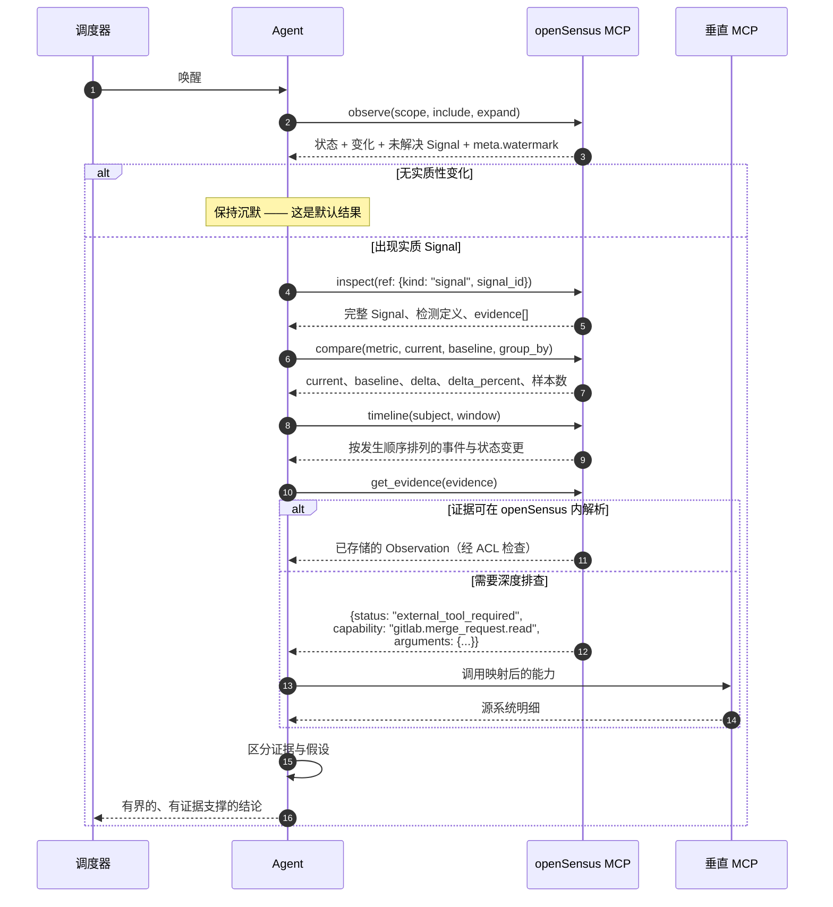

证据移交是关键设计决策。openSensus 返回的是**能力名**（`gitlab.merge_request.read`），
而不是服务器名或工具名，因此 Agent Harness 可以把它映射到实际安装的垂直 MCP。
openSensus 不代理凭据，协议 §5.3 也禁止把凭据放进 resolver 参数。

信号触发唤醒是可选的扩展。协议指出触发载荷只应携带 Signal ID、subject、severity、
title 和 MCP 连接引用；Agent 必须通过 MCP 重新读取授权后的详细信息，而不能把触发
载荷当作完整上下文来信任。

---

## 13. 扩展点

### 新增一种 Observation kind

1. 在 `src/protocol.ts` 中新增 data schema 并扩展判别联合（discriminated union）。
2. 在 `src/store.ts` 中新增 `project*` 方法，并在 `ingest` 的 `switch` 中加分支。
3. **在 `rebuildSubject` 中补上同样的分支**，否则修正功能会失效——这是最容易漏的
   一步。
4. 显式决定合并纪律。不要默认使用 upsert。
5. 决定它是否参与 Signal 检测，以及是否写入 `source_entities`。
6. 若它属于时间线内容，加入 timeline 的 `kind IN (...)` 过滤。
7. 为新 kind 补一个覆盖迟到数据与修正的测试。

### 新增检测方法

`Signal.detection.method` 已经允许 `statistical`、`model`、`manual`，但只实现了
`rule`。新增方法需要：在 `projectMetric` 之后有一个求值位置、证据收集，以及一个
确定性 `signal_id`——身份生成方案是生命周期管理成立的前提，不能跳过。

### 替换存储

所有 SQL 都限定在 `src/store.ts` 内。`SensusWorld`、`src/mcp.ts` 和 `src/http.ts`
接触不到任何查询。换到 PostgreSQL 意味着重新实现 `SensusStore` 的公开接口；必须保住
的两个行为是事务性投影（插入与投影原子完成）和 [§6.5](#65-重放使用的排序) 的重放
排序。

---

## 14. 已知限制

这些都是真实存在的，部署前值得了解。前三条是设计本身的属性，而不是未完成的工作。

| 限制 | 细节 | 影响 |
| --- | --- | --- |
| SQLite 是单写者 | 已开启 WAL，但同一时刻只有一个写入者 | 摄入吞吐被串行化。对 Connector 类负载足够，不适合高吞吐流式场景。PostgreSQL 是突破它的途径 |
| 后端无法热切换 | `SENSUS_DATABASE_URL` 在进程启动时读取一次 | 从 SQLite 迁到 PostgreSQL 意味着向新后端重新摄入，没有就地转换 |
| 没有 schema 迁移 | 表在连接时用 `CREATE TABLE IF NOT EXISTS` 创建，也没有版本表 | 涉及列变更的升级需要手工 DDL。升级前先备份，也不要用旧二进制连新表结构 |
| 长尾身份提供方不支持 | `IdentityResolver` 覆盖 OIDC/JWT 与共享 API Key；Kerberos、mTLS、自研 SSO 不在范围内 | 提供方不常见的部署去实现一个 `resolve()` 方法，而不是等支持 |
| stdio MCP 是单身份的 | stdio 传输不携带按请求凭据 | 多用户部署必须使用 Streamable HTTP 的 MCP 端点 |
| 规则变更会丢失确认状态 | `reevaluateAllSignals` 删除并重建该租户的全部 Signal | 人工设置的 `acknowledged` 状态无法在规则编辑后保留 |
| 规则变更是 O(序列数) | 每次 upsert/delete 都全量重算 | 指标序列较多的租户会有可感知的开销 |
| 实体字段没有来源优先级 | `projectEntity` 用 `occurred_at` 比较且为 `<=`，时间戳相同时由写入先后决定 | 协议 §7.4 要求 Runtime 定义每字段的来源优先级，尚未实现 |
| Signal 只从指标派生 | 检测只在 `projectMetric` 中运行 | 尚无基于事件或状态的检测路径 |
| 证据查找是子串扫描 | `findEvidence` 对最近 100 条做 `evidence_json LIKE '%ref%'` | 无索引支撑；规模上需要证据索引 |
| 部分读取存在规模悬崖 | `listEntities` 先截断 1000 行再过滤 ACL；`getRecentMetricChanges` 每条序列一次查询；PostgreSQL 上的 `canReadObservation` 同样是逐行一次查询 | MVP 规模可用，大租户下会退化 |
| `watermark` 是有界扫描 | `latestWatermark` 只看最新的 1000 条 Observation，并在其中报告最新可读的一条 | 若该 principal 对这 1000 条都无权限，会看到 epoch，读起来像"什么都没发生"而不是"我没权限"。改成带 ACL 的查询才能修好 |
| PostgreSQL 写路径存在单向死锁 | 摄入先持按 subject 的 advisory lock，再触碰 syncs 行；而 `completeSync` 先持 syncs 行，再执行摄入。PostgreSQL 会以 `40P01` 中止其中一方，表现为 500 | 仅在并发摄入与同一 open sync 的完成竞争时出现。目前不做重试，由调用方重试 |
| 没有推送或订阅 | Agent 依赖调度轮询 | v0.1 有意为之；协议 §19 推迟了推送投递 |
| 批量端点是顺序的 | 逐条处理，因此在实测的单写入速率下，一个 1000 条的批次大约需要四秒。各条目相互独立，在不同 subject 之间做有界并发是安全的——投影锁已经把需要串行的情形串行化了 | 大批量比后端实际能力更慢。数字见 [§6](#6-写入路径) |
| 并发是按 subject 局部化的，不是全局的 | 在 PostgreSQL 上写入按 subject 串行（[§6.6](#66-并发)） | 触碰同一 subject 的两个写入者会互相排队。为多写入者部署做容量规划时，要度量这个，而不只是连接数 |

协议 §19 列出了更完整的推迟清单：跨源实体归并、规则 DSL、自然语言查询、订阅、
自动执行动作、联邦 Runtime 发现、完整双时态修正语义，以及向量检索。

---

## 15. 合规性

协议在 [§17](sensus-protocol-v0.1.md) 中定义了三种角色的合规要求：

- **Producer**——稳定且幂等的 Observation ID、合法时间戳、带命名空间的源标识、
  重试时不改变载荷、保留访问元数据。
- **Runtime**——校验并持久化存储、实现幂等与冲突语义、物化全部六种投影、保留溯源、
  暴露全部六个 MCP 工具、返回 watermark、强制执行授权。
- **MCP Server**——认证 Consumer 主体、把租户选择排除在模型生成的参数之外、暴露
  只读工具、对结果做有界化与分页、为派生断言返回证据、不泄露凭据或不可访问内容。

[§18](sensus-protocol-v0.1.md) 定义了参考端到端流程，本实现正是为满足它而构建——
从 GitLab 的 review 请求 webhook，一直到 Agent 给出有界的、有证据支撑的结论。
