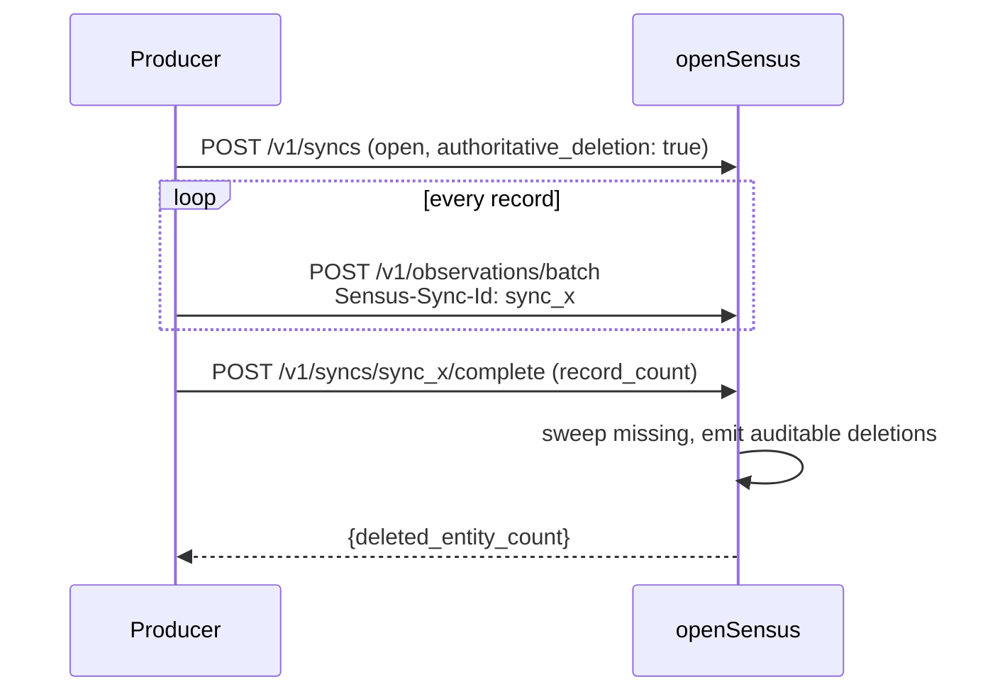

# openSensus Integration Guide

[English](integration-guide.md) | [简体中文](integration-guide.zh-CN.md)

A hands-on guide to connecting a system to openSensus, connecting an agent to openSensus, and
running the result. Every command and response in this document was executed against
the reference implementation.

For the normative wire contract, see the [protocol specification](sensus-protocol-v0.1.md).
For design rationale, see the [architecture document](architecture.md).

---

## Contents

- [1. Before you start](#1-before-you-start)
  - [Deployment constraints](#deployment-constraints)
- [2. Part A — Run the runtime](#2-part-a--run-the-runtime)
- [3. Part B — Build a Producer](#3-part-b--build-a-producer)
- [4. Part C — Connect an agent](#4-part-c--connect-an-agent)
- [5. Part D — Configure detection rules](#5-part-d--configure-detection-rules)
- [6. Part E — Operate it](#6-part-e--operate-it)
- [7. Troubleshooting](#7-troubleshooting)
- [8. Storage and scaling out](#8-storage-and-scaling-out)
- [9. Where identity stops](#9-where-identity-stops)

---

## 1. Before you start

### The three roles

| Role | What it does | How it talks to openSensus |
| --- | --- | --- |
| **Producer** | Observes a source system and submits facts | HTTP: `POST /v1/observations` |
| **Runtime operator** | Runs the process, sets identity and tenant config | Environment variables |
| **Consumer** | Reads the world and investigates | MCP: `observe`, `inspect`, `timeline`, `query`, `compare`, `get_evidence` |

Most integrations only need one or two of these. A GitLab connector plus a scheduled
agent is the canonical shape.

### The mental model

You do not send openSensus "the current state of the world". You send **append-only
facts**, each stamped with when it was true, and openSensus works out the current state.

That distinction matters in practice. Your connector should be a dumb, reliable pipe:
read from the source, emit an Observation per fact, retry on failure. All the
interesting work — resolving conflicts, handling late arrivals, detecting changes —
happens inside the runtime.

### Prerequisites

- Node.js 22 or later
- npm
- For agent integration: an MCP-capable host

### Deployment constraints

Read this before designing a deployment. Every item below is a property of the current
implementation, not a configuration choice.

| Constraint | What it means | What to do today |
| --- | --- | --- |
| **stdio MCP is single-identity** | The stdio transport carries no per-request credential, so a stdio process serves whatever identity its environment names. | Use the Streamable HTTP MCP endpoint for anything multi-user, and keep stdio for a single trusted agent. |
| **A request-named tenant is refused by default** | With `SENSUS_TENANT_ID` set, a request naming another tenant is rejected with `403 PERMISSION_DENIED`. With it unset, the tenant must come from the identity (`mapping.tenant.allowed`); a request that names its own tenant is refused unless `SENSUS_ALLOW_REQUEST_TENANT=true`, because nothing vouches for it. | Pin the tenant when one process serves one tenant. For multi-tenant, let the identity decide and treat `mapping.tenant.allowed` as a security control, reviewed like a firewall rule. |
| **A single writer** | SQLite permits one writer at a time, and projection runs synchronously inside the write transaction. | Ingest from one connector process per source rather than many concurrent writers, and keep batches in the low hundreds. Expect hundreds of observations per second, not thousands. |
| **Identity providers are OIDC or a shared key** | Kerberos, mTLS to an internal CA, and bespoke SSO are not supported. | Implement `IdentityResolver` — one `resolve()` method returning a `ConsumerContext`. |
| **The storage backend is fixed at process start** | `SENSUS_DATABASE_URL` selects PostgreSQL, otherwise SQLite at `SENSUS_DB_PATH`. There is no live switching. | Pick one per deployment and restart to change it. See [§8](#8-storage-and-scaling-out). |

If one of these blocks your use case, that use case is not supported yet rather than
merely unconfigured.

---

## 2. Part A — Run the runtime

```bash
npm install
npm run build
```

Seed the demo scenario (optional, useful for exploring the read tools):

```bash
SENSUS_DB_PATH=./data/demo.db npm run seed
```

Start the ingestion API:

```bash
SENSUS_DB_PATH=./data/demo.db \
SENSUS_TENANT_ID=acme \
SENSUS_API_KEY=local-secret \
npm start
```

It listens on `http://127.0.0.1:8787`.

### Configuration

| Variable | Default | Applies to | Meaning |
| --- | --- | --- | --- |
| `SENSUS_DATABASE_URL` | *(unset)* | HTTP + MCP | PostgreSQL connection string. **When set, it replaces SQLite entirely** |
| `SENSUS_DB_PATH` | `data/sensus.db` | HTTP + MCP | SQLite file path, used when `SENSUS_DATABASE_URL` is unset. Use an absolute path for the MCP process |
| `SENSUS_TENANT_ID` | *(unset)* | HTTP + MCP | Pins the tenant. On HTTP a mismatching body `tenant_id` is rejected; on MCP it selects what the agent can see |
| `SENSUS_ALLOW_REQUEST_TENANT` | `false` | HTTP | Lets a request name its own tenant when neither the identity nor `SENSUS_TENANT_ID` determined one. **Trusts the caller** — only safe behind an identity that already constrains tenants |
| `SENSUS_PG_POOL_MAX` | `10` | HTTP + MCP (PostgreSQL) | Maximum connections in the pool |
| `SENSUS_API_KEY` | *(unset)* | HTTP | Bearer token. **When unset, authentication is disabled** |
| `SENSUS_PRINCIPALS` | `role:agent` | HTTP + MCP | Comma-separated Consumer principals |
| `SENSUS_CLEARANCE` | `internal` | HTTP + MCP | Maximum clearance. An unrecognized value silently falls back to `internal` |
| `HOST` | `127.0.0.1` | HTTP | Bind address |
| `PORT` | `8787` | HTTP | Listen port |

`SENSUS_TENANT_ID` is the important one. Setting it turns tenant into a
deployment-level property, so no caller — human or agent — can reach another tenant
by crafting a request. Without it, the tenant has to come from the identity resolver's
`tenant.claim`, and a request that names a tenant itself is refused: the runtime will
not act on a tenant that nothing vouches for. `SENSUS_ALLOW_REQUEST_TENANT=true` turns
that refusal back into trust, which is only reasonable when the identity resolver is
already limiting which tenants a token may name.

### Health check

```bash
curl -H 'Authorization: Bearer local-secret' http://127.0.0.1:8787/health
```

```json
{ "status": "ok", "service": "sensus", "protocol": "sensus/0.1" }
```

> **Gotcha:** `/health` sits behind the same bearer check as every other route. When
> `SENSUS_API_KEY` is set, an unauthenticated health check returns `401`, which can
> look like a broken service to a load balancer. Either send the header from your
> probe, or expose health on a separate unauthenticated port.

### Inspecting ingestion without a server

The seed script and the test suite drive `SensusStore` directly, so you can validate a
payload set without starting HTTP:

```bash
npm run seed          # ingests test/fixtures.ts and prints accepted/duplicate/signals
npm test              # 12 integration tests
npm run check         # type-check only
```

---

## 3. Part B — Build a Producer

### 3.1 Choose an Observation kind

Pick the kind by asking what the fact *is*, not what table it belongs to.

| You want to record | Kind | Notes |
| --- | --- | --- |
| A thing exists, or one of its descriptive fields changed | `entity.observed` | Partial patch. Also feeds the reconciliation presence ledger — see [3.8](#38-snapshots-and-reconciliation) |
| Two things are related, or a relation ended | `relation.observed` | Relation identity includes your source, so you will not clobber another system's view |
| Something happened at a point in time | `event.occurred` | Immutable timeline entry. Never retracted — corrected instead |
| A field's current value changed | `state.observed` | Latest value wins. Late arrivals never overwrite newer state |
| A number was measured over a point or interval | `metric.observed` | Append-only series. This is what Signal rules evaluate |

Two rules of thumb:

- If you would ever want to chart it over time, it is a `metric.observed`, not a
  `state.observed`.
- If someone can ask "when did this happen?", it is an `event.occurred`.

### 3.2 Your first Observation

```bash
curl -X POST http://127.0.0.1:8787/v1/observations \
  -H 'Authorization: Bearer local-secret' \
  -H 'Content-Type: application/json' \
  -d '{
    "spec_version": "sensus/0.1",
    "observation_id": "obs_example_1",
    "tenant_id": "acme",
    "kind": "state.observed",
    "subject": {
      "type": "software.change",
      "id": "gitlab:acme/payments-api!3812"
    },
    "occurred_at": "2026-09-16T09:10:00Z",
    "observed_at": "2026-09-16T09:10:04Z",
    "source": { "system": "gitlab", "instance": "acme-gitlab" },
    "data": {
      "field": "software.review_status",
      "operation": "set",
      "value": "waiting"
    }
  }'
```

Response:

```json
{
  "observation_id": "obs_example_1",
  "status": "accepted",
  "received_at": "2026-09-17T02:26:13.180Z",
  "generated_signals": []
}
```

Required fields: `spec_version`, `observation_id`, `tenant_id`, `kind`, `subject`,
`occurred_at`, `observed_at`, `source`, `data`.

`generated_signals` is worth watching — it tells you when an ingested metric
immediately produced or resolved a Signal.

### 3.3 Identifiers

`subject.type` must be lowercase, dot-separated, and semantic:

```text
organization.team        software.repository      software.change
software.work_item       person                   organization.department
```

`subject.id` must be stable within the tenant. Namespace it with the source system:

```text
gitlab:acme/payments-api!3812       jira:acme/ENG-1024
github:acme/payments#3812           hris:acme/employee-1938
org:acme/team/payments
```

You do not need a canonical cross-system ID before ingesting. If two systems describe
the same real-world thing, join them later with an `identity.same_as` relation.
Cross-source merge is explicitly deferred ([protocol §19](sensus-protocol-v0.1.md)).

Unknown types are accepted and preserved, so you can start ingesting before your
ontology is settled. Use a reverse-domain namespace for custom types:

```text
com.acme.risk_assessment      io.vendor.special_event
```

### 3.4 Generating idempotent `observation_id`

This is the part integrators most often get wrong, and it decides whether retries are
safe.

**The contract:** repeating an `observation_id` with the same canonical payload is a
no-op returning `status: "duplicate"`. Repeating it with a *different* payload is a
`409` conflict. So the ID must be derived from the fact's identity, not from
wall-clock time or a random UUID.

**The failure to avoid:** generating a fresh UUID on every poll. Every poll then
creates a new Observation, the log grows without bound, and `state.observed` ends up
with a thousand identical rows at slightly different `occurred_at` values.

Recommended recipes:

| Your source gives you | Derive `observation_id` from |
| --- | --- |
| A unique delivery/webhook ID | that ID — `obs_` + delivery ID |
| A record with a version or `updated_at` | `hash(record_id, version)` |
| Only the record's current field values | `hash(record_id, field, canonical_value)` |

A hash-based helper:

```ts
import { createHash } from "node:crypto";

function observationId(...parts: string[]): string {
  const digest = createHash("sha256").update(parts.join("\u001f")).digest("hex");
  return `obs_${digest.slice(0, 24)}`;
}

// state that changes over time: identity includes the value
const id = observationId("gitlab", "acme-gitlab", "mr!3812", "review_status", "waiting");

// a versioned record: identity includes the version
const id2 = observationId("jira", "acme-jira", "ENG-1024", String(record.updatedAt));
```

The runtime uses exactly this construction internally (`stableId` in
`src/protocol.ts`), including for synthesized reconciliation and Signal IDs.

> **Why include the value?** If two different values share an `observation_id`, you get
> a `409` instead of two facts. Including the value means "the state changed" produces
> a new Observation, while "I polled again and nothing changed" produces a clean
> duplicate.

### 3.5 Timestamps

All timestamps must be RFC 3339 with an explicit offset. `Z` and `+08:00` are both
accepted; a bare `2026-09-16T09:10:00` with no offset is **rejected**.

| Field | Set it to | If you get it wrong |
| --- | --- | --- |
| `occurred_at` | When the fact became true in the source | Late-arrival protection compares against it, so a wrong value can make a real change lose to an older one |
| `observed_at` | When your connector read it | Less load-bearing, but must still be present and valid |

For a webhook, `occurred_at` is the event timestamp from the payload and `observed_at`
is when your handler received it. For a poller, `occurred_at` should be the source
record's own change time (its `updated_at`), **not** the time of your poll —
otherwise every poll looks like a fresh change.

### 3.6 Access metadata

Every Observation accepts an `access` policy:

```json
{
  "access": {
    "classification": "confidential",
    "allow": ["team:security"],
    "deny": ["user:contractor-17"]
  }
}
```

Principal strings are namespaced (`user:`, `team:`, `role:`) and matched exactly
against the Consumer's principal set.

Three behaviours to internalize, because they surprise people:

1. **Omitting `access` does not mean public.** The default classification is
   `internal`. A Consumer with `public` clearance cannot read it.
2. **`deny` beats `allow`.** A principal in both lists is denied.
3. **`inherit_from_source: true` with no resolved `allow`/`deny` denies everyone.**
   This is deliberate fail-closed behaviour: if you claim to inherit a source ACL, you
   must resolve it to an explicit allow or deny set before ingesting.

The payoff is field-level granularity. Each `entity.observed` field remembers which
Observation wrote it, so a Consumer who cannot read one Observation still sees the
entity's other fields. You can send a restricted attribute onto an existing entity
without hiding the entity itself:

```json
{
  "kind": "entity.observed",
  "subject": { "type": "software.change", "id": "gitlab:acme/payments-api!3812" },
  "data": { "attributes": { "security_risk": "critical" } },
  "access": { "classification": "confidential", "allow": ["team:security"] }
}
```

An ordinary consumer sees the entity, its name, and its other attributes — but not
`security_risk`, and the entity's `updated_at` ignores the hidden field.

### 3.7 Evidence and the vertical handoff

Attach evidence to claims that an agent may need to verify:

```json
{
  "evidence": [
    {
      "type": "source_record",
      "ref": "gitlab://acme/payments-api/merge_requests/3812",
      "resolver": {
        "capability": "gitlab.merge_request.read",
        "arguments": { "project": "acme/payments-api", "merge_request_iid": 3812 }
      }
    }
  ]
}
```

`resolver.capability` names an **ability**, not a server or tool. When the agent calls
`get_evidence`, openSensus returns:

```json
{
  "resolution": {
    "status": "external_tool_required",
    "capability": "gitlab.merge_request.read",
    "arguments": { "project": "acme/payments-api", "merge_request_iid": 3812 }
  }
}
```

The Agent Harness maps that capability to whichever vertical MCP is installed. This is
how openSensus stays out of the credential-proxying business.

Two constraints:

- **Never put credentials in `resolver.arguments`.** Protocol §5.3 forbids it, and the
  arguments are returned to the agent verbatim.
- **Evidence must be attached at ingest time to be resolvable.** `get_evidence` looks
  up refs across stored Observations. An evidence ref that was never attached to any
  Observation returns `NOT_FOUND` — it is not a free-form lookup service.

### 3.8 Snapshots and reconciliation

Webhooks drop events, and systems contain history that predates openSensus. Send a
periodic snapshot so the runtime can detect what has disappeared.



**Step 1 — open the sync:**

```bash
curl -X POST http://127.0.0.1:8787/v1/syncs \
  -H 'Authorization: Bearer local-secret' \
  -H 'Content-Type: application/json' \
  -d '{
    "tenant_id": "acme",
    "sync_id": "sync_gitlab_20260917",
    "mode": "reconciliation",
    "source": { "system": "gitlab", "instance": "acme-gitlab" },
    "authoritative_deletion": true
  }'
```

**Step 2 — submit members with the sync header:**

```text
Sensus-Sync-Id: sync_gitlab_20260917
```

**Step 3 — complete with the exact count:**

```bash
curl -X POST http://127.0.0.1:8787/v1/syncs/sync_gitlab_20260917/complete \
  -H 'Authorization: Bearer local-secret' \
  -H 'Content-Type: application/json' \
  -d '{ "record_count": 1842, "cursor": "gitlab:2026-09-17T10:00:00Z" }'
```

Rules that the runtime enforces, all of which will reject your request rather than
silently misbehave:

| Rule | Violation |
| --- | --- |
| `authoritative_deletion` requires mode `snapshot` or `reconciliation` | `409 SYNC_CONFLICT` |
| Observation `source.system`/`instance` must equal the sync's source | `409 SYNC_CONFLICT` |
| Sync must be `open` when members arrive or when completing | `409 SYNC_CONFLICT` |
| `record_count` must equal the actual attached member count | `409 SYNC_CONFLICT` |
| `sync_id` must not already exist | `409 SYNC_CONFLICT` |

**Only `entity.observed` feeds the presence ledger.** If a record type never sends
`entity.observed`, authoritative deletion simply never applies to it — a quiet failure
mode worth checking if deletions are not happening.

**Deletion is conservative.** An entity is marked deleted only when the completed
snapshot was authoritative *and* no other source still reports it as present. Deleting
from GitLab will not remove an entity that Service Catalog also reports.

**The count check is your friend.** If a snapshot partially fails, `record_count`
mismatches and you get a `409` instead of a mass deletion of live entities. Retry the
snapshot; do not "fix" it by sending a smaller count.

**Re-sending is safe.** Submitting an already-known Observation inside a sync is an
idempotent duplicate, but it still re-attaches to the sync and can restore an entity
that was previously marked deleted. Re-running a full snapshot is a legitimate
recovery strategy.

### 3.9 Batching

```bash
curl -X POST http://127.0.0.1:8787/v1/observations/batch \
  -H 'Authorization: Bearer local-secret' \
  -H 'Content-Type: application/json' \
  -d '{ "observations": [ /* up to 1000 */ ] }'
```

```json
{
  "accepted": 2,
  "rejected": 1,
  "results": [
    { "observation_id": "obs_1", "status": "accepted", "received_at": "..." },
    { "observation_id": "obs_2", "status": "duplicate", "received_at": "..." },
    {
      "observation_id": "obs_3",
      "status": "rejected",
      "error": { "code": "INVALID_OBSERVATION", "message": "...", "retryable": false }
    }
  ]
}
```

Key properties:

- Maximum 1000 Observations per batch.
- **Items are independent.** One bad Observation does not reject the batch — it gets a
  `rejected` entry while the rest are ingested. Always inspect per-item results; a
  `200` does not mean everything succeeded.
- The whole batch runs as sequential transactions, so it is not atomic.
- Request bodies are capped at 10 MB regardless of item count.

Practical guidance: batch in the low hundreds. Because projection runs synchronously
inside each transaction, a very large batch holds the single SQLite writer for a long
time.

### 3.10 Error handling and retry

| HTTP | Code | Meaning | Retry? |
| --- | --- | --- | --- |
| 200 | — | Accepted, or idempotent duplicate | — |
| 400 | `INVALID_JSON` | Body is not valid JSON | No — fix the payload |
| 400 | `INVALID_ARGUMENT` | Missing required header (e.g. tenant) | No |
| 401 | `UNAUTHENTICATED` | Missing or wrong bearer token | No |
| 403 | `PERMISSION_DENIED` | Tenant mismatch | No |
| 404 | `NOT_FOUND` | Route or resource not found | No |
| 409 | `CONFLICT` | `observation_id` reused with a different payload | No — **use a new ID** |
| 409 | `SYNC_CONFLICT` | Sync state or count problem | Depends — see below |
| 409 | `CORRECTION_CONFLICT` | Invalid correction target/disposition | No |
| 413 | `PAYLOAD_TOO_LARGE` | Body over 10 MB | No — split the batch |
| 422 | `INVALID_OBSERVATION` | Valid JSON, violated the schema | No — fix the payload |
| 500 | `INTERNAL` | Unexpected server error | Yes, with backoff |

Error shape:

```json
{
  "error": {
    "code": "PERMISSION_DENIED",
    "message": "Request tenant does not match the configured tenant",
    "retryable": false
  }
}
```

A `409 CONFLICT` is the one to watch in production. It means your ID derivation
produced the same ID for two different facts. The right response is to fix the
derivation (usually by including the source's version or the field value), not to
retry.

Retry guidance: retry idempotently with the *same* payload and the *same*
`observation_id`. Rewriting the payload on retry turns a safe duplicate into a
conflict.

### 3.11 Producer conformance checklist

- [ ] `observation_id` is derived from the fact's identity, not from time or randomness
- [ ] Retries reuse the identical payload and ID
- [ ] `occurred_at` comes from the source's own change time, not from poll time
- [ ] Timestamps carry an explicit offset
- [ ] `subject.id` is namespaced and stable
- [ ] Access metadata is attached where the source has it, and never left as an
      unresolved `inherit_from_source`
- [ ] Evidence refs are attached to the Observations that assert them
- [ ] A periodic authoritative snapshot runs for anything that can be deleted upstream
- [ ] Per-item batch results are inspected, not just the HTTP status

---

## 4. Part C — Connect an agent

### 4.1 Choose a transport

| | stdio | Streamable HTTP |
| --- | --- | --- |
| Entry point | `dist/src/mcp.js` | `dist/src/mcp-http.js` (`npm run mcp:http`) |
| Default port | — | `MCP_PORT`, 8788 |
| Identity | One per process, from the environment | Per request, from the caller's credential |
| Use when | A single trusted agent on the same host | Several users or agents share one endpoint |

**stdio** — configure the MCP host:

```json
{
  "mcpServers": {
    "sensus": {
      "command": "node",
      "args": ["/absolute/path/to/sensus/dist/src/mcp.js"],
      "env": {
        "SENSUS_DB_PATH": "/absolute/path/to/data/demo.db",
        "SENSUS_TENANT_ID": "acme",
        "SENSUS_PRINCIPALS": "role:agent,team:payments",
        "SENSUS_CLEARANCE": "internal"
      }
    }
  }
}
```

**Streamable HTTP** — start the endpoint and point the agent at `http://host:8788/mcp`:

```bash
SENSUS_DB_PATH=/absolute/path/to/data/demo.db \
SENSUS_TENANT_ID=acme \
SENSUS_IDENTITY=/absolute/path/to/identity.json \
npm run mcp:http
```

The endpoint refuses to start without `SENSUS_IDENTITY` unless you set
`SENSUS_MCP_ALLOW_ANONYMOUS=true`, which serves every caller as one identity and belongs
only on a loopback interface.

Run `npm run build` first. Use an **absolute** `SENSUS_DB_PATH` — the MCP process may
start in a different working directory than the HTTP server.

### 4.2 Identity

**stdio** reads identity from the environment. It is trusted process configuration, not
authentication:

| Setting | Effect |
| --- | --- |
| `SENSUS_TENANT_ID` | Which tenant the agent can see. Not overridable by tool input |
| `SENSUS_PRINCIPALS` | Which `allow`/`deny` entries match. An empty set can still read anything with no `allow` list |
| `SENSUS_CLEARANCE` | Ceiling on classification: `public` < `internal` < `confidential` < `restricted` |

To scope an agent to a team's data, give it that team's principal and nothing else:

```text
SENSUS_PRINCIPALS=role:agent,team:payments
SENSUS_CLEARANCE=internal
```

This agent will not see `confidential` Observations, nor anything whose `allow` list
does not include one of its two principals.

**Streamable HTTP** authorizes every request against the resolver named by
`SENSUS_IDENTITY`, a JSON file:

```json
{
  "oidc": {
    "issuer": "https://login.example.com/",
    "audience": "sensus-mcp"
  },
  "mapping": {
    "principals": [
      { "claim": "groups", "prefix": "team:", "map": { "payments-team": "team:payments" } }
    ],
    "clearance": {
      "from_groups": { "sec-cleared": "confidential" },
      "default": "internal",
      "ceiling": "confidential"
    },
    "tenant": { "claim": "tenant_id", "allowed": ["acme"] }
  }
}
```

`jwks_uri` is discovered from `{issuer}/.well-known/openid-configuration` when omitted.
A shared secret is configured instead with `"api_key": "..."`, which accepts
`Authorization: Bearer <value>` and suits service accounts. The principals and clearance
that secret is granted come from `api_key_identity`:

```json
{
  "api_key": "service-account-secret",
  "api_key_identity": { "principals": ["role:producer", "team:payments"], "clearance": "internal" }
}
```

The ingestion API accepts the same file, so connectors authenticate the same way.

Four behaviours worth knowing before wiring this up:

- **`mapping.tenant.allowed` is required whenever `tenant.claim` is set.** Without an
  allowlist a token could name any tenant, so the configuration is rejected at startup.
- **`clearance.ceiling` caps whatever the provider asserts.** A misconfigured identity
  provider cannot grant more than the deployment allows.
- **`anonymous` is a separate decision from verification.** Omitting it requires a
  credential on every request. Setting it serves a request that carries *no* credential
  as that identity — and a request carrying an unverifiable credential is still
  rejected, never quietly downgraded to anonymous. The MCP HTTP endpoint additionally
  refuses to start in that mode unless `SENSUS_MCP_ALLOW_ANONYMOUS=true`.
- **`system` can never come from an identity.** The mapping layer hardcodes it to false.

### 4.3 Tool reference

All six tools are read-only. Every response carries a `meta` block:

```json
{
  "meta": {
    "request_id": "req_1f2e...",
    "tenant_id": "acme",
    "as_of": "2026-09-17T02:26:13.194Z",
    "watermark": "2026-09-16T00:00:05.000Z",
    "truncated": false
  }
}
```

- `as_of` — when the runtime answered.
- `watermark` — the newest `received_at` **visible to this principal**. Lets the agent
  tell "nothing happened" apart from "I am not cleared to see what happened", within a
  bounded scan: the runtime looks at the newest 1000 Observations, so a principal cleared
  for none of that window gets the epoch rather than a precise answer
  ([§14](architecture.md#14-known-limits)).
- `truncated` — the result hit a bound. `next_cursor` is present when more data exists.

#### `observe` — start here

Bounded first view of a scope: current state, recent metric changes, open Signals.

```json
{
  "scope": { "type": "organization.team", "id": "org:acme/team/payments" },
  "include": ["state", "changes", "signals"],
  "limit": 50,
  "expand": {
    "direction": "incoming",
    "relations": ["organization.owned_by", "software.belongs_to"],
    "max_depth": 2,
    "max_nodes": 100
  }
}
```

`expand` walks the relation graph from the scope and rolls related state, changes, and
Signals into the same response. Direction is relative to the edge: `incoming` finds
entities whose relation points *at* the scope (for a team, the repositories owned by
it). Traversal is cycle-safe, ACL-filtered at every hop, depth-bounded (≤ 5) and
node-bounded (≤ 500).

#### `inspect` — details for one thing

```json
{ "kind": "entity", "entity": { "type": "software.change", "id": "gitlab:acme/payments-api!3812" },
  "include": ["state", "relations", "metrics", "evidence"] }
```

```json
{ "kind": "signal", "signal_id": "sig_01K5802QS2GAP67S6M84R4QYNS" }
```

#### `timeline` — what happened, in order

```json
{
  "subject": { "type": "software.change", "id": "gitlab:acme/payments-api!3812" },
  "window": { "from": "2026-09-08T00:00:00Z", "to": "2026-09-17T00:00:00Z" },
  "limit": 50
}
```

Returns `event.occurred` and `state.observed` entries in occurrence-time order. `from`
must be ≤ `to`.

#### `query` — structured search

```json
{
  "resource": "signal",
  "where": [
    { "field": "severity", "op": "eq", "value": "critical" },
    { "field": "status", "op": "eq", "value": "open" }
  ],
  "order_by": { "field": "updated_at", "direction": "desc" },
  "limit": 50
}
```

Operators: `eq`, `neq`, `in`, `gt`, `gte`, `lt`, `lte`, `exists`. Field paths may be
nested with dots. There is no query language in v0.1 by design.

#### `compare` — metric vs. baseline

```json
{
  "metric": "software.review_wait_time",
  "scope": { "type": "organization.team", "id": "org:acme/team/payments" },
  "current":  { "from": "2026-09-09T00:00:01Z", "to": "2026-09-16T00:00:00Z" },
  "baseline": { "from": "2026-09-02T00:00:00Z", "to": "2026-09-09T00:00:00Z" },
  "aggregation": "average",
  "group_by": ["repository"]
}
```

Returns per-group `current`, `baseline`, `delta`, `delta_percent`, sample counts, unit,
and evidence. This is the tool that turns a Signal into a defensible number.

#### `get_evidence` — verify or hand off

```json
{
  "evidence": { "type": "observation", "ref": "sensus://observation/acme/obs_m2" },
  "format": "structured"
}
```

Two outcomes:

- **Resolvable inside openSensus** — returns the stored Observation (ACL-checked), or a
  compact text form with `"format": "text"`.
- **Needs a vertical tool** — returns `resolution.status: "external_tool_required"`
  with a `capability` for the harness to map.

### 4.4 Recommended agent loop

```text
wake
  -> observe(scope)
      no material change  -> remain silent, stop
      material Signal     -> continue
  -> inspect(signal)      read detection definition and evidence
  -> compare(metric)      quantify the change
  -> timeline(subject)    establish sequence
  -> get_evidence(ref)    verify, or hand off to a vertical MCP
  -> report a bounded conclusion, separating evidence from hypothesis
```

Guidance worth encoding in your agent's system prompt:

- **Silence is the default outcome.** A scheduled agent that reports "nothing
  happened" every cycle trains its readers to ignore it.
- **Treat Signals as derived.** They are runtime conclusions, not source facts. The
  MCP server instructions already say so; reinforce it.
- **Quote the detection definition** when reporting a Signal, so the reader can judge
  the rule, not just the headline.
- **Check `meta.truncated`.** A partial rollup presented as complete is worse than no
  rollup.
- **Prefer `get_evidence` over asserting.** If evidence is not resolvable, say so
  rather than paraphrasing the Signal title.

### 4.5 Consumers and the MCP server

The MCP server is read-only in v0.1. Agents that need to act — comment on an MR, close
a ticket — do so through the vertical MCP, using the capability that openSensus handed
them. This is the intended division of labour, not a missing feature.

---

## 5. Part D — Configure detection rules

Rules are per-tenant, persisted, and applied immediately to existing metric series.

```bash
curl -X POST http://127.0.0.1:8787/v1/signal-rules \
  -H 'Authorization: Bearer local-secret' \
  -H 'Content-Type: application/json' \
  -d '{
    "tenant_id": "acme",
    "rule": {
      "rule_id": "review_wait_slo",
      "name": "Review wait exceeds seven hours",
      "enabled": true,
      "applies_to": {
        "metric": "software.review_wait_time",
        "subject_types": ["organization.team"],
        "dimensions": { "repository": "payments-api" }
      },
      "condition": { "kind": "threshold", "operator": "gt", "value": 7, "for_samples": 2 },
      "signal_type": "software.review_wait_slo_breach",
      "severity": "critical",
      "confidence": 1
    }
  }'
```

### Rule fields

| Field | Notes |
| --- | --- |
| `rule_id` | Stable identity. Re-posting the same ID updates the rule |
| `applies_to.metric` | Exact metric name, or `*` for all |
| `applies_to.subject_types` | Optional filter on subject type |
| `applies_to.dimensions` | Subset match — every listed dimension must equal the sample's value |
| `condition` | `threshold` or `relative_change` (below) |
| `signal_type` | The `type` on generated Signals |
| `severity` | `info`, `warning`, `critical` |
| `confidence` | 0–1, copied onto generated Signals |
| `title` | Optional override; otherwise a title is generated from the change |

### Conditions

**`threshold`** — fires when the last `for_samples` samples all satisfy the comparison:

```json
{ "kind": "threshold", "operator": "gt", "value": 7, "for_samples": 2 }
```

`operator` is one of `gt`, `gte`, `lt`, `lte`.

**`relative_change`** — fires when the last `for_samples` consecutive sample-to-sample
changes all exceed a percentage:

```json
{
  "kind": "relative_change",
  "direction": "increase",
  "threshold_percent": 50,
  "minimum_baseline": 0,
  "for_samples": 1
}
```

`minimum_baseline` suppresses the rule when the baseline magnitude is below it, which
stops a jump from 0.1 to 0.3 from reading as a 200% incident.

Note the arithmetic: N consecutive *changes* require N+1 *samples*. A rule with
`for_samples: 2` needs three metric points before it can fire.

### Lifecycle semantics

| Action | Effect |
| --- | --- |
| Condition matches | Signal created (`open`) or refreshed. `detected_at` is preserved from first detection |
| Condition stops matching | Signal → `resolved`. The record is **kept**, not deleted |
| Condition matches again | Signal → `open` again, original `detected_at` intact |
| Rule updated or deleted | **All** Signals for the tenant are deleted and re-evaluated from the metric log |

Signal identity is
`hash(tenant, rule_id, subject_type, subject_id, metric, dimensions_hash)`. A stable
identity is why the same series updates one Signal instead of spawning a new one each
evaluation.

> **Important:** because a rule change wipes and rebuilds all Signals, an
> `acknowledged` state set on a Signal does not survive a rule edit. If your workflow
> depends on acknowledgements, avoid editing rules during an active incident.

If a tenant has no rules at all, a built-in default applies:
`metric.significant_increase` — a 50% relative increase, severity `warning`. Inserting
your first rule **disables** that default, since tenant rules take precedence
entirely.

### Choosing `for_samples`

| Value | Use when |
| --- | --- |
| `1` | Single-sample thresholds, or noisy metrics where speed beats precision |
| `2`–`3` | SLO breaches and capacity signals — filters transient spikes |
| Higher | Rarely. `for_samples` is capped at 20, and each increment delays detection by one sample interval |

---

## 6. Part E — Operate it

### Storage

SQLite in WAL mode. Two consequences:

- `SENSUS_DB_PATH` plus `-wal` and `-shm` sidecar files are the complete state. Copy
  all three for a consistent backup, or use `sqlite3 db ".backup out.db"`.
- **One writer at a time.** Ingestion is serialized. Throughput is fine for connector
  workloads (hundreds of observations per second) and not suitable for high-volume
  streaming.

### Process model

The HTTP server and the MCP server are **separate processes sharing one database
file**. That is the intended topology:

```text
connector --HTTP--> sensus-http (writer) --+
                                            +--> same SQLite file
agent --stdio MCP--> sensus-mcp (reader) --+
```

Both handle `SIGINT`/`SIGTERM` with a graceful close.

### Logging

Both entry points log to stderr: bind address and database path on HTTP startup;
tenant, principals, and clearance on MCP startup. That MCP line is the fastest way to
diagnose "the agent can't see anything" — check the principals first.

Unexpected HTTP errors are logged before a generic `500` is returned, so the client
never sees internals but the operator does.

### Backup and reset

```bash
sqlite3 data/demo.db ".backup backup-$(date +%F).db"   # consistent copy
sqlite3 data/demo.db "SELECT COUNT(*) FROM observations"  # log size
```

To rebuild projections from scratch, stop the writer, delete every table except
`observations` (and `signal_rules` if you want to keep rules), and restart — the
runtime recreates schema with `CREATE TABLE IF NOT EXISTS` but does **not** backfill
projections on startup. To force a full replay, re-ingest the log through a
correction-style rebuild or replay your source snapshots.

### Upgrades

Schema changes are applied by `migrate()` on startup using `CREATE TABLE IF NOT
EXISTS` plus additive `ALTER TABLE ADD COLUMN` for newer fields. There is no
down-migration and no version table. Back up before upgrading, and do not run an older
binary against a newer database.

---

## 7. Troubleshooting

| Symptom | Likely cause | Fix |
| --- | --- | --- |
| `/health` returns 401 | `SENSUS_API_KEY` is set and the probe sends no bearer token | Send the header, or run health on a separate port |
| Every poll creates new Observations | `observation_id` includes a timestamp or is random | Derive it from the fact's identity ([3.4](#34-generating-idempotent-observation_id)) |
| `409 CONFLICT` on retry | The payload changed between attempts | Retry with the identical payload and ID |
| `409 CONFLICT` on a normal ingest | Two different facts share an `observation_id` | Include the source's version or the field value in the derivation |
| `409 SYNC_CONFLICT` on complete | `record_count` ≠ attached members | Recount. Do not lower the number to force it through |
| `409 SYNC_CONFLICT` on member submit | Observation source ≠ sync source | The sync is per source instance; open one per source |
| Agent sees nothing | Wrong tenant, or clearance below the data's classification | Check the MCP startup log line; compare `SENSUS_CLEARANCE` with the ingested `classification` |
| Agent sees some fields missing | Field-level ACLs are working | Expected if the Observation that wrote that field is restricted |
| `get_evidence` returns NOT_FOUND | The ref was never attached to an ingested Observation | Attach evidence at ingest time |
| `422 INVALID_OBSERVATION` on a valid-looking payload | Timestamp without an offset, or `value` missing on a `state.observed` `set` | Add `Z`/`+08:00`; include `value` when `operation` is `set` |
| Deletions never happen | Record types do not emit `entity.observed` | Only `entity.observed` feeds the presence ledger |
| Entity deleted that still exists elsewhere | Not possible by design | Check whether the other source stopped ingesting — presence is per source |
| No Signals from a new rule | Rule disabled, dimensions mismatch, or not enough samples | Check `enabled`, `applies_to.dimensions`, and that `for_samples` is satisfiable |
| Old `acknowledged` Signals reset | A rule was edited | Expected; rule edits rebuild all Signals |
| Signals resolved unexpectedly | Rule deleted, or metrics corrected | Deleting a rule removes its derived Signals |

---

## 8. Storage and scaling out

`SENSUS_DATABASE_URL` selects PostgreSQL; without it, SQLite at `SENSUS_DB_PATH`. Both
implement the same contract in `src/storage.ts` and pass the same 32-case conformance
suite.

```bash
# PostgreSQL
SENSUS_DATABASE_URL=postgres://user@127.0.0.1:5432/sensus npm start

# SQLite (the default)
SENSUS_DB_PATH=./data/sensus.db npm start
```

The backend is chosen **once, at process start**, and is not switched live. A connection
pool, its schema assumptions and the contract's async shape are all bound for the life of
the process, so changing backends means restarting it.

### Choosing between them

| | SQLite | PostgreSQL |
| --- | --- | --- |
| Setup | none | a server and a database |
| Writers | one at a time; ingestion is serialized | concurrent |
| Scale | single node | horizontal, and the natural home for Row Level Security |
| Use when | local development, a single connector, a demo | more than one ingestion writer, or growth past one node |

SQLite in WAL mode handles connector workloads comfortably — hundreds of observations per
second. It is write serialization, not the read path, that stops scaling.

Three notes that apply to PostgreSQL specifically:

- **Bind parameters are not the same thing as a transaction.** Rule evaluation runs inside
  the transaction that wrote the rule, so any read it performs must go through that
  transaction's connection. A read issued through the pool opens a second connection that
  cannot see the uncommitted row, and the rule silently appears to have no effect until
  the next ingest. `PostgresStorage` threads the client explicitly for this reason.
- **Writes serialize per subject, not globally.** Concurrent writers touching different
  entities proceed in parallel; two touching the same entity queue behind each other's
  advisory lock. Sizing an ingestion fleet means measuring contention on your hot
  subjects, not counting connections. See
  [Architecture §6.6](architecture.md#66-concurrency).
- **Schema is created on connect** with `CREATE TABLE IF NOT EXISTS`. There is no
  migration tool and no version table, so point it at a database you are willing to let
  it own.

Finishing it requires an **asynchronous read path**, and this is the part that is easy
to underestimate. `better-sqlite3` is synchronous by design, `pg` is asynchronous, and
Node exposes no synchronous network I/O. The contract in `src/storage.ts` is therefore
asynchronous, and `SensusWorld` — along with `mcp.ts`, `mcp-http.ts` and `http.ts` —
must become asynchronous too. It is a mechanical refactor rather than a redesign, but
it touches every read.

### Running the conformance suite

Both backends are held to `test/conformance.ts`, which is backend-agnostic. SQLite runs
against an in-memory database; PostgreSQL needs a reachable server:

```bash
SENSUS_TEST_DATABASE_URL=postgres://user@127.0.0.1:5432/sensus_test npm test
```

Without one, the PostgreSQL suite reports a skip rather than a failure, so `npm test`
stays green on a machine with no database — but the skip is visible.

This suite is not a formality. It caught a defect that SQLite structurally could not
have: rule evaluation runs inside the transaction that wrote the rule, and a read
issued through the connection pool opens a *second* connection that cannot see the
uncommitted row. The rule appeared to have no effect until the next ingest. Any new
backend should be held to the same suite for the same reason.

### If you write another backend

The contract and its two invariants are documented in `src/storage.ts`:

1. **Transactional projection.** The insert and every projection side effect happen in
   one transaction. Splitting them creates a window where a reader sees an Observation
   with no projection.
2. **The replay order** in
   [`ORDER BY occurred_at, COALESCE(source_sequence, -1), received_at, observation_id`](architecture.md#65-ordering-used-by-replay).
   Deterministic rebuild depends on this total order, including the trailing
   `observation_id`.

Four implementation notes carried over from the PostgreSQL port:

- Keep timestamps as ISO 8601 **text**. Handing them to the database as a native
  timestamp type introduces normalization — UTC conversion, sub-second rounding — and
  the backends then disagree on ties.
- Keep JSON columns as **text**, not a native JSON type. `contentHash` depends on exact
  serialization, and a `jsonb` column reorders keys, which silently changes the hash
  and breaks idempotency across restarts.
- `contentHash`, `canonicalJson` and `dimensions_hash` stay in the application layer.
- `findEvidence` does `evidence_json LIKE '%ref%'`; it is the one read path that is not
  index-backed and should become an evidence table or a GIN index.

Per-tenant isolation is enforced by `tenant_id` in every primary key. Row Level Security
is a natural fit on PostgreSQL and is worth adding.

## 9. Where identity stops

Authentication is implemented as far as OIDC and shared API keys. It deliberately stops
there.

Beyond that line, the shapes of enterprise identity are unbounded — Kerberos, mTLS to an
internal CA, bespoke SSO, proxies that rewrite headers. Do not expect them here. The
extension point is `IdentityResolver` in `src/identity.ts`: one `resolve()` method
returning a `ConsumerContext`, plus an optional tenant. A deployment with an unusual
provider implements that interface rather than waiting for support.

Three rules the mapping layer enforces, which a custom resolver must not undermine:

1. Clearance is capped by `clearance.ceiling`, so a misconfigured or compromised
   provider cannot raise it.
2. A tenant taken from a token must appear in `tenant.allowed`.
3. `system` is never true. It bypasses every item ACL, so no external identity may
   produce it.
