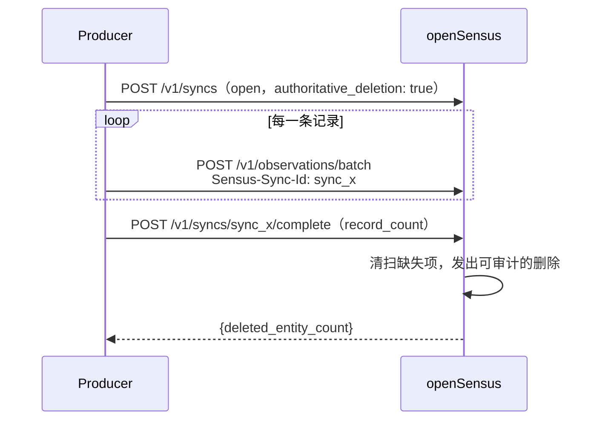

# openSensus 接入文档

[English](integration-guide.md) | [简体中文](integration-guide.zh-CN.md)

本文是一份动手向的指南，说明如何把系统接入 openSensus、如何把 Agent 接到 openSensus，以及
如何运维这套组合。文中所有命令与响应都在参考实现上实际执行过。

规范性的接口契约见[协议规范](sensus-protocol-v0.1.md)，设计取舍见
[架构文档](architecture.zh-CN.md)。

---

## 目录

- [1. 开始之前](#1-开始之前)
  - [部署约束](#部署约束)
- [2. A 部分 —— 运行 Runtime](#2-a-部分--运行-runtime)
- [3. B 部分 —— 编写 Producer](#3-b-部分--编写-producer)
- [4. C 部分 —— 接入 Agent](#4-c-部分--接入-agent)
- [5. D 部分 —— 配置检测规则](#5-d-部分--配置检测规则)
- [6. E 部分 —— 运维](#6-e-部分--运维)
- [7. 故障排查](#7-故障排查)
- [8. 存储与横向扩展](#8-存储与横向扩展)
- [9. 身份层到此为止](#9-身份层到此为止)

---

## 1. 开始之前

### 三种角色

| 角色 | 职责 | 与 openSensus 的交互方式 |
| --- | --- | --- |
| **Producer** | 观察源系统并提交事实 | HTTP：`POST /v1/observations` |
| **Runtime 运维者** | 运行进程、配置身份与租户 | 环境变量 |
| **Consumer** | 读取世界并进行排查 | MCP：`observe`、`inspect`、`timeline`、`query`、`compare`、`get_evidence` |

多数接入只需要其中一到两种角色。一个 GitLab Connector 加一个定时 Agent 就是最典型
的形态。

### 心智模型

你不是在给 openSensus 发送"世界的当前状态"，而是在发送**只追加的事实**，每个事实带上
它在源世界何时为真，由 openSensus 推导出当前状态。

这个区分在实践中很重要。你的 Connector 应该是一根笨但可靠的管道：读源系统、每个
事实发一条 Observation、失败就重试。所有有意思的工作——冲突消解、迟到处理、变更
检测——都发生在 Runtime 内部。

### 前置条件

- Node.js 22 或更高
- npm
- 接入 Agent 时：一个支持 MCP 的宿主

### 部署约束

在设计部署方案之前请先读这一节。下面每一条都是当前实现的**固有属性**，而不是可配置项。

| 约束 | 含义 | 当前怎么做 |
| --- | --- | --- |
| **stdio MCP 是单身份的** | stdio 传输不携带按请求的凭据，因此该进程服务的身份由它的环境变量决定。 | 多用户场景请用 Streamable HTTP 的 MCP 端点；stdio 留给单台主机上的单一可信 Agent。 |
| **请求自报的租户默认会被拒绝** | 设置 `SENSUS_TENANT_ID` 时，请求指定其他租户会返回 `403 PERMISSION_DENIED`。不设置时，租户必须来自身份（`mapping.tenant.allowed`）；未设置 `SENSUS_ALLOW_REQUEST_TENANT=true` 时，自报租户的请求一律拒绝，因为没有任何东西为其背书。 | 一个进程服务一个租户时就锁定它。多租户场景让身份来定，并把 `mapping.tenant.allowed` 当作安全控制，像审防火墙规则一样审它。 |
| **单写者** | SQLite 同一时刻只允许一个写入者，且投影在写事务内同步执行。 | 每个数据源只由一个 Connector 进程摄入，不要多进程并发写；批量大小控制在几百条以内。预期量级是每秒数百条，而不是数千条。 |
| **身份提供方仅支持 OIDC 与共享密钥** | Kerberos、指向内部 CA 的 mTLS、自研 SSO 均不支持。 | 实现 `IdentityResolver`——只有一个 `resolve()` 方法，返回 `ConsumerContext`。 |
| **存储后端在进程启动时固定** | `SENSUS_DATABASE_URL` 选用 PostgreSQL，否则用 `SENSUS_DB_PATH` 指向的 SQLite。没有热切换。 | 每个部署选定一个，更换需要重启。见 [§8](#8-存储与横向扩展)。 |

如果其中某条约束挡住了你的用例，那说明该用例目前**不被支持**，而不只是"还没配置"。

---

## 2. A 部分 —— 运行 Runtime

```bash
npm install
npm run build
```

导入演示场景（可选，便于体验读取工具）：

```bash
SENSUS_DB_PATH=./data/demo.db npm run seed
```

启动摄入 API：

```bash
SENSUS_DB_PATH=./data/demo.db \
SENSUS_TENANT_ID=acme \
SENSUS_API_KEY=local-secret \
npm start
```

默认监听 `http://127.0.0.1:8787`。

### 配置项

| 变量 | 默认值 | 作用于 | 含义 |
| --- | --- | --- | --- |
| `SENSUS_DATABASE_URL` | *（未设置）* | HTTP + MCP | PostgreSQL 连接串。**设置后完全取代 SQLite** |
| `SENSUS_DB_PATH` | `data/sensus.db` | HTTP + MCP | SQLite 文件路径，在未设置 `SENSUS_DATABASE_URL` 时生效。MCP 进程建议用绝对路径 |
| `SENSUS_TENANT_ID` | *（未设置）* | HTTP + MCP | 锁定租户。HTTP 侧会拒绝 tenant_id 不匹配的请求体；MCP 侧决定 Agent 能看到什么 |
| `SENSUS_ALLOW_REQUEST_TENANT` | `false` | HTTP | 当身份与 `SENSUS_TENANT_ID` 都未确定租户时，允许请求自报租户。**等于信任调用方**——只有在本就有租户约束的身份之后才安全 |
| `SENSUS_PG_POOL_MAX` | `10` | HTTP + MCP（PostgreSQL） | 连接池上限 |
| `SENSUS_API_KEY` | *（未设置）* | HTTP | Bearer Token。**未设置时鉴权关闭** |
| `SENSUS_PRINCIPALS` | `role:agent` | HTTP + MCP | 逗号分隔的 Consumer principal |
| `SENSUS_CLEARANCE` | `internal` | HTTP + MCP | 最大密级。无法识别的取值会静默回退为 `internal` |
| `HOST` | `127.0.0.1` | HTTP | 绑定地址 |
| `PORT` | `8787` | HTTP | 监听端口 |

其中最重要的是 `SENSUS_TENANT_ID`。设置它之后，租户就成为部署级属性，任何调用方——
无论人或 Agent——都无法通过构造请求访问其他租户。不设置时，租户必须来自身份解析器的
`tenant.claim`；自报租户的请求会被拒绝，因为运行时不会在一个没有背书的目标租户上执行
操作。`SENSUS_ALLOW_REQUEST_TENANT=true` 可以把这份拒绝换回信任，但只有在身份解析器
已经限制了 token 可指定哪些租户时才合理。

### 健康检查

```bash
curl -H 'Authorization: Bearer local-secret' http://127.0.0.1:8787/health
```

```json
{ "status": "ok", "service": "sensus", "protocol": "sensus/0.1" }
```

> **坑点：** `/health` 与其他所有路由走同一套 Bearer 校验。设置 `SENSUS_API_KEY` 后，
> 不带鉴权的健康检查会返回 `401`，在负载均衡器看来像是服务挂了。要么探针带上
> Header，要么把健康检查暴露在单独的免鉴权端口上。

### 不起服务也能验证摄入

seed 脚本和测试套件直接驱动 `SensusStore`，因此可以不启动 HTTP 就验证一批载荷：

```bash
npm run seed          # 摄入 test/fixtures.ts 并输出 accepted/duplicate/signals
npm test              # 集成测试；无数据库时相关套件自行跳过
npm run check         # 仅做类型检查
```

---

## 3. B 部分 —— 编写 Producer

### 3.1 选择 Observation 类型

按"这个事实**是什么**"来选，而不是按"它该进哪张表"来选。

| 你要记录的内容 | Kind | 说明 |
| --- | --- | --- |
| 某个东西存在，或它的某个描述性字段变了 | `entity.observed` | 局部补丁。同时写入对账存在账本，见 [3.8](#38-快照与对账) |
| 两个东西产生了关联，或关联结束 | `relation.observed` | 关系身份包含你的来源，因此不会覆盖其他系统的视图 |
| 某个时刻发生了一件事 | `event.occurred` | 不可变的时间线条目。永不撤回，只能修正 |
| 某个字段的当前值变了 | `state.observed` | 最新值胜出。迟到数据不会覆盖较新的状态 |
| 某个数值在时点或区间上被测得 | `metric.observed` | 只追加序列。Signal 规则评估的就是它 |

两条经验法则：

- 如果你会想把它画成趋势图，它是 `metric.observed`，不是 `state.observed`。
- 如果会有人问"这是什么时候发生的？"，它是 `event.occurred`。

### 3.2 第一条 Observation

```bash
curl -X POST http://127.0.0.1:8787/v1/observations \
  -H 'Authorization: Bearer local-secret' \
  -H 'Content-Type: application/json' \
  -d '{
    "spec_version": "sensus/0.1",
    "observation_id": "obs_example_1",
    "tenant_id": "acme",
    "kind": "state.observed",
    "subject": {
      "type": "software.change",
      "id": "gitlab:acme/payments-api!3812"
    },
    "occurred_at": "2026-09-16T09:10:00Z",
    "observed_at": "2026-09-16T09:10:04Z",
    "source": { "system": "gitlab", "instance": "acme-gitlab" },
    "data": {
      "field": "software.review_status",
      "operation": "set",
      "value": "waiting"
    }
  }'
```

响应：

```json
{
  "observation_id": "obs_example_1",
  "status": "accepted",
  "received_at": "2026-09-17T02:26:13.180Z",
  "generated_signals": []
}
```

必填字段：`spec_version`、`observation_id`、`tenant_id`、`kind`、`subject`、
`occurred_at`、`observed_at`、`source`、`data`。

`generated_signals` 值得关注——它告诉你这条摄入的指标是否立刻产生或解决了 Signal。

### 3.3 标识符

`subject.type` 必须是小写、点分隔、语义化的：

```text
organization.team        software.repository      software.change
software.work_item       person                   organization.department
```

`subject.id` 必须在租户内稳定，并带上源系统的命名空间前缀：

```text
gitlab:acme/payments-api!3812       jira:acme/ENG-1024
github:acme/payments#3812           hris:acme/employee-1938
org:acme/team/payments
```

摄入之前**不需要**先有跨系统的规范化 ID。如果两个系统描述的是同一个现实对象，之后
用 `identity.same_as` 关系把它们连起来即可。跨源归并是被明确推迟的
（[协议 §19](sensus-protocol-v0.1.md)）。

未知类型会被接受并保留，因此你可以在本体论尚未定型时就开始摄入。自定义类型建议使用
反向域名命名：

```text
com.acme.risk_assessment      io.vendor.special_event
```

### 3.4 生成幂等的 `observation_id`

这是接入方最容易做错的一环，它决定了重试是否安全。

**契约：** 用相同的 `observation_id` 重复提交相同载荷，是无副作用的
`status: "duplicate"`；用相同 ID 提交**不同**载荷，则返回 `409` 冲突。因此 ID 必须由
事实的身份推导而来，而不能来自墙上时钟或随机 UUID。

**要避免的坑：** 每次轮询都生成一个新 UUID。这样每次轮询都会产生一条新 Observation，
日志无限增长，`state.observed` 会堆积上千条 `occurred_at` 略有差异的相同记录。

推荐做法：

| 源系统提供的信息 | `observation_id` 推导自 |
| --- | --- |
| 唯一的投递 ID / webhook ID | 该 ID —— `obs_` + 投递 ID |
| 带版本号或 `updated_at` 的记录 | `hash(record_id, version)` |
| 只有记录的当前字段值 | `hash(record_id, field, canonical_value)` |

一个基于哈希的辅助函数：

```ts
import { createHash } from "node:crypto";

function observationId(...parts: string[]): string {
  const digest = createHash("sha256").update(parts.join("\u001f")).digest("hex");
  return `obs_${digest.slice(0, 24)}`;
}

// 会随时间变化的状态：身份包含值
const id = observationId("gitlab", "acme-gitlab", "mr!3812", "review_status", "waiting");

// 带版本的记录：身份包含版本
const id2 = observationId("jira", "acme-jira", "ENG-1024", String(record.updatedAt));
```

Runtime 内部用的正是同一套构造（`src/protocol.ts` 的 `stableId`），包括合成的对账
Observation 和 Signal ID。

> **为什么要把值包含进去？** 如果两个不同的值共用一个 `observation_id`，你会得到
> `409` 而不是两条事实。把值包含进来后，"状态变了"会产生新 Observation，而"我又轮询
> 了一次，什么都没变"会干净地变成 duplicate。

### 3.5 时间戳

所有时间戳必须是带显式偏移量的 RFC 3339。`Z` 和 `+08:00` 都可以，而裸的
`2026-09-16T09:10:00`（无偏移量）会被**拒绝**。

| 字段 | 应设为 | 设错的后果 |
| --- | --- | --- |
| `occurred_at` | 事实在源系统变为真的时刻 | 迟到保护以它为比较基准，错误的取值会让真实变更输给更早的旧值 |
| `observed_at` | 你的 Connector 读到它的时刻 | 承重较轻，但仍必须存在且合法 |

对 webhook 而言，`occurred_at` 取载荷里的事件时间，`observed_at` 取处理器收到的时间。
对轮询器而言，`occurred_at` 应取源记录自身的变更时间（其 `updated_at`），**而不是**你
轮询的时刻——否则每次轮询看起来都是一次新变更。

### 3.6 访问元数据

每条 Observation 都接受一个 `access` 策略：

```json
{
  "access": {
    "classification": "confidential",
    "allow": ["team:security"],
    "deny": ["user:contractor-17"]
  }
}
```

principal 字符串带命名空间（`user:`、`team:`、`role:`），与 Consumer 的 principal 集合
做精确匹配。

有三条行为需要内化，因为它们常常出人意料：

1. **省略 `access` 不等于公开。** 默认密级是 `internal`，密级为 `public` 的 Consumer
   读不到。
2. **`deny` 优先于 `allow`。** 同时出现在两个列表里的 principal 会被拒绝。
3. **`inherit_from_source: true` 且未解析 `allow`/`deny` 时，拒绝所有人。** 这是刻意的
   fail-closed 行为：既然你声称继承来源 ACL，就必须在摄入前把它解析成显式的 allow
   或 deny 集合。

回报是**字段级**的粒度。每条 `entity.observed` 字段都记得是哪条 Observation 写的它，
因此读不到某条 Observation 的 Consumer 仍能看到该实体的其他字段。你可以把受限属性
加到既有实体上，而不必隐藏实体本身：

```json
{
  "kind": "entity.observed",
  "subject": { "type": "software.change", "id": "gitlab:acme/payments-api!3812" },
  "data": { "attributes": { "security_risk": "critical" } },
  "access": { "classification": "confidential", "allow": ["team:security"] }
}
```

普通 consumer 仍能看到该实体、它的名称和其他属性——但看不到 `security_risk`，而且实体
的 `updated_at` 会忽略这个隐藏字段。

### 3.7 证据与垂直移交

对 Agent 可能需要验证的断言，附上证据：

```json
{
  "evidence": [
    {
      "type": "source_record",
      "ref": "gitlab://acme/payments-api/merge_requests/3812",
      "resolver": {
        "capability": "gitlab.merge_request.read",
        "arguments": { "project": "acme/payments-api", "merge_request_iid": 3812 }
      }
    }
  ]
}
```

`resolver.capability` 命名的是**能力**，不是某个服务器或工具。当 Agent 调用
`get_evidence` 时，openSensus 返回：

```json
{
  "resolution": {
    "status": "external_tool_required",
    "capability": "gitlab.merge_request.read",
    "arguments": { "project": "acme/payments-api", "merge_request_iid": 3812 }
  }
}
```

Agent Harness 把这个能力映射到实际安装的垂直 MCP。openSensus 就是这样避开凭据代理这件事的。

两条约束：

- **绝不要把凭据放进 `resolver.arguments`。** 协议 §5.3 禁止这么做，而且这些参数会原样
  返回给 Agent。
- **证据必须在摄入时就附上才可解析。** `get_evidence` 是在已存储的 Observation 里查找
  引用。从未附着到任何 Observation 的证据引用会返回 `NOT_FOUND`——它不是通用的查询
  服务。

### 3.8 快照与对账

Webhook 会丢事件，系统里也有早于 openSensus 存在的数据。周期性发送快照，Runtime 才能发现
什么东西消失了。



**第 1 步 —— 开启 sync：**

```bash
curl -X POST http://127.0.0.1:8787/v1/syncs \
  -H 'Authorization: Bearer local-secret' \
  -H 'Content-Type: application/json' \
  -d '{
    "tenant_id": "acme",
    "sync_id": "sync_gitlab_20260917",
    "mode": "reconciliation",
    "source": { "system": "gitlab", "instance": "acme-gitlab" },
    "authoritative_deletion": true
  }'
```

**第 2 步 —— 带 sync 头提交成员：**

```text
Sensus-Sync-Id: sync_gitlab_20260917
```

**第 3 步 —— 用精确的条数完成：**

```bash
curl -X POST http://127.0.0.1:8787/v1/syncs/sync_gitlab_20260917/complete \
  -H 'Authorization: Bearer local-secret' \
  -H 'Content-Type: application/json' \
  -d '{ "record_count": 1842, "cursor": "gitlab:2026-09-17T10:00:00Z" }'
```

Runtime 强制执行的规则如下，任何一条不满足都会拒绝请求，而不是静默地做错事：

| 规则 | 违反时 |
| --- | --- |
| `authoritative_deletion` 只允许 `snapshot` 或 `reconciliation` 模式 | `409 SYNC_CONFLICT` |
| Observation 的 `source.system`/`instance` 必须等于 sync 的 source | `409 SYNC_CONFLICT` |
| 成员到达时与完成时，sync 必须处于 `open` | `409 SYNC_CONFLICT` |
| `record_count` 必须等于实际挂载的成员数 | `409 SYNC_CONFLICT` |
| `sync_id` 不能已存在 | `409 SYNC_CONFLICT` |

**只有 `entity.observed` 会写入存在账本。** 如果某类记录从不发 `entity.observed`，权威
删除对它根本不会生效——如果发现删除没发生，这是一个值得检查的静默失败模式。

**删除是保守的。** 只有当已完成的快照是权威的、*且*没有其他来源仍报告该实体存在时，
才会标记删除。从 GitLab 删除不会移除 Service Catalog 也在报告的实体。

**条数校验是你的朋友。** 如果快照部分失败，`record_count` 会对不上，你会拿到 `409`
而不是批量删除存活实体。请重试快照，不要靠"改小数字"来绕过。

**重发是安全的。** 在 sync 内提交一条已知的 Observation 会变成幂等 duplicate，但它仍
会重新挂载到本次 sync，并可能恢复先前被标记删除的实体。因此，重跑一次全量快照是合法
的恢复手段。

### 3.9 批量提交

```bash
curl -X POST http://127.0.0.1:8787/v1/observations/batch \
  -H 'Authorization: Bearer local-secret' \
  -H 'Content-Type: application/json' \
  -d '{ "observations": [ /* 最多 1000 条 */ ] }'
```

```json
{
  "accepted": 2,
  "rejected": 1,
  "results": [
    { "observation_id": "obs_1", "status": "accepted", "received_at": "..." },
    { "observation_id": "obs_2", "status": "duplicate", "received_at": "..." },
    {
      "observation_id": "obs_3",
      "status": "rejected",
      "error": { "code": "INVALID_OBSERVATION", "message": "...", "retryable": false }
    }
  ]
}
```

关键性质：

- 单批最多 1000 条。
- **各条目相互独立。** 一条坏 Observation 不会导致整批失败——它得到一条 `rejected`
  记录，其余照常摄入。务必检查逐条结果：`200` 不代表全部成功。
- 整批按顺序逐条事务执行，因此**不是原子的**。
- 无论条目多少，请求体上限都是 10 MB。

实践建议：批量大小控制在几百条以内。因为投影在每个事务内同步执行，过大的批次会让
SQLite 的单写者被长时间占用。

### 3.10 错误处理与重试

| HTTP | Code | 含义 | 是否重试 |
| --- | --- | --- | --- |
| 200 | — | 已接受，或幂等 duplicate | — |
| 400 | `INVALID_JSON` | 请求体不是合法 JSON | 否——修正载荷 |
| 400 | `INVALID_ARGUMENT` | 缺少必需请求头（如租户） | 否 |
| 401 | `UNAUTHENTICATED` | Bearer Token 缺失或错误 | 否 |
| 403 | `PERMISSION_DENIED` | 租户不匹配 | 否 |
| 404 | `NOT_FOUND` | 路由或资源不存在 | 否 |
| 409 | `CONFLICT` | `observation_id` 被用于不同载荷 | 否——**换一个新 ID** |
| 409 | `SYNC_CONFLICT` | sync 状态或条数问题 | 视情况，见下 |
| 409 | `CORRECTION_CONFLICT` | 修正目标或 disposition 非法 | 否 |
| 413 | `PAYLOAD_TOO_LARGE` | 请求体超过 10 MB | 否——拆分批次 |
| 422 | `INVALID_OBSERVATION` | JSON 合法但违反 schema | 否——修正载荷 |
| 500 | `INTERNAL` | 意外的服务端错误 | 是，带退避 |

错误结构：

```json
{
  "error": {
    "code": "PERMISSION_DENIED",
    "message": "Request tenant does not match the configured tenant",
    "retryable": false
  }
}
```

生产中最需要盯的是 `409 CONFLICT`。它意味着你的 ID 推导把两条不同的事实映射到了同一个
ID。正确的应对是修正推导逻辑（通常是加入源系统的版本号或字段值），而不是重试。

重试原则：用**相同的**载荷和**相同的** `observation_id` 做幂等重试。重试时改写载荷会把
一次安全的 duplicate 变成 conflict。

### 3.11 Producer 合规检查清单

- [ ] `observation_id` 由事实身份推导，而非来自时间或随机数
- [ ] 重试复用完全相同的载荷与 ID
- [ ] `occurred_at` 取自源系统自身的变更时间，而非轮询时刻
- [ ] 时间戳带显式偏移量
- [ ] `subject.id` 带命名空间且稳定
- [ ] 源系统有权限信息时就附上访问元数据，且绝不留下未解析的 `inherit_from_source`
- [ ] 证据引用附着在断言它的那条 Observation 上
- [ ] 对上游可能被删除的数据，周期性运行权威快照
- [ ] 检查批量的逐条结果，而不只看 HTTP 状态码

---

## 4. C 部分 —— 接入 Agent

### 4.1 选择传输方式

| | stdio | Streamable HTTP |
| --- | --- | --- |
| 入口 | `dist/src/mcp.js` | `dist/src/mcp-http.js`（`npm run mcp:http`） |
| 默认端口 | — | `MCP_PORT`，8788 |
| 身份 | 每进程一个，来自环境变量 | 每请求一个，来自调用方凭据 |
| 适用 | 同主机上的单一可信 Agent | 多个用户或 Agent 共用一个端点 |

**stdio** —— 配置 MCP 宿主：

```json
{
  "mcpServers": {
    "sensus": {
      "command": "node",
      "args": ["/absolute/path/to/sensus/dist/src/mcp.js"],
      "env": {
        "SENSUS_DB_PATH": "/absolute/path/to/data/demo.db",
        "SENSUS_TENANT_ID": "acme",
        "SENSUS_PRINCIPALS": "role:agent,team:payments",
        "SENSUS_CLEARANCE": "internal"
      }
    }
  }
}
```

**Streamable HTTP** —— 启动端点，让 Agent 连到 `http://host:8788/mcp`：

```bash
SENSUS_DB_PATH=/absolute/path/to/data/demo.db \
SENSUS_TENANT_ID=acme \
SENSUS_IDENTITY=/absolute/path/to/identity.json \
npm run mcp:http
```

未配置 `SENSUS_IDENTITY` 时该端点**拒绝启动**，除非显式设置
`SENSUS_MCP_ALLOW_ANONYMOUS=true`——那会把所有调用方都按一个身份服务，只应出现在回环
接口上。

先执行 `npm run build`。`SENSUS_DB_PATH` 请用**绝对路径**——MCP 进程的工作目录可能
与 HTTP 服务不同。

### 4.2 身份与密级

**stdio** 从环境变量读取身份。它是可信的进程配置，而不是认证：

| 配置 | 效果 |
| --- | --- |
| `SENSUS_TENANT_ID` | Agent 能看到的租户。工具入参无法覆盖 |
| `SENSUS_PRINCIPALS` | 参与 `allow`/`deny` 匹配的集合。即使为空，仍可读取没有 `allow` 列表的数据 |
| `SENSUS_CLEARANCE` | 密级上限：`public` < `internal` < `confidential` < `restricted` |

要把 Agent 限定在某团队的数据范围内，就只给它该团队的 principal：

```text
SENSUS_PRINCIPALS=role:agent,team:payments
SENSUS_CLEARANCE=internal
```

这个 Agent 看不到 `confidential` 的 Observation，也看不到 `allow` 列表不含它任一
principal 的内容。

**Streamable HTTP** 会对每个请求按 `SENSUS_IDENTITY` 指向的 resolver 授权，该变量是一个
JSON 文件：

```json
{
  "oidc": {
    "issuer": "https://login.example.com/",
    "audience": "sensus-mcp"
  },
  "mapping": {
    "principals": [
      { "claim": "groups", "prefix": "team:", "map": { "payments-team": "team:payments" } }
    ],
    "clearance": {
      "from_groups": { "sec-cleared": "confidential" },
      "default": "internal",
      "ceiling": "confidential"
    },
    "tenant": { "claim": "tenant_id", "allowed": ["acme"] }
  }
}
```

省略 `jwks_uri` 时会从 `{issuer}/.well-known/openid-configuration` 自动发现。也可以改用
共享密钥：`"api_key": "..."`，它接受 `Authorization: Bearer <value>`，适合服务账号。该
密钥被授予的 principal 与密级来自 `api_key_identity`：

```json
{
  "api_key": "service-account-secret",
  "api_key_identity": { "principals": ["role:producer", "team:payments"], "clearance": "internal" }
}
```

摄入 API 接受同一个文件，因此 Connector 用同样的方式认证。

接线前值得知道的四条行为：

- **设置了 `tenant.claim` 就必须同时设置 `mapping.tenant.allowed`。** 没有允许名单时
  token 可以指定任意租户，因此该配置会在启动时被拒绝。
- **`clearance.ceiling` 会给提供方断言的一切封顶。** 配错的身份提供方无法授出超过部署
  允许的密级。
- **`anonymous` 是与凭据校验相互独立的一件事。** 省略它意味着每个请求都必须带凭据。
  设置它则把**不带**凭据的请求当作该身份服务；而带了无法校验的凭据的请求仍然会被拒绝，
  绝不会被悄悄降级为匿名。该模式下 MCP HTTP 端点还会拒绝启动，除非同时设置
  `SENSUS_MCP_ALLOW_ANONYMOUS=true`。
- **`system` 永远不可能来自身份。** 映射层把它硬编码为 false。

### 4.3 工具参考

六个工具全部只读。每个响应都带 `meta` 块：

```json
{
  "meta": {
    "request_id": "req_1f2e...",
    "tenant_id": "acme",
    "as_of": "2026-09-17T02:26:13.194Z",
    "watermark": "2026-09-16T00:00:05.000Z",
    "truncated": false
  }
}
```

- `as_of` —— Runtime 作答的时刻。
- `watermark` —— **对该 principal 可见**的最新 `received_at`。让 Agent 能区分"什么都没
  发生"和"发生了但我无权看到"，但只是在一个有界扫描范围内：运行时只看最新的 1000 条
  Observation，因此对该窗口全部无权限的 principal 会拿到 epoch，而不是精确答案
  （[§14](architecture.zh-CN.md#14-已知限制)）。
- `truncated` —— 结果触到了某个上界。还有更多数据时会带 `next_cursor`。

#### `observe` —— 从这里开始

某个 scope 的有界首视图：当前状态、近期指标变化、未解决的 Signal。

```json
{
  "scope": { "type": "organization.team", "id": "org:acme/team/payments" },
  "include": ["state", "changes", "signals"],
  "limit": 50,
  "expand": {
    "direction": "incoming",
    "relations": ["organization.owned_by", "software.belongs_to"],
    "max_depth": 2,
    "max_nodes": 100
  }
}
```

`expand` 从 scope 出发遍历关系图，把相关的状态、变化和 Signal 汇总进同一个响应。
direction 是相对边而言的：`incoming` 找出那些关系**指向**该 scope 的实体（对团队来说，
就是它拥有的代码库）。遍历防环、逐跳做 ACL 过滤、深度上界（≤ 5）、节点上界（≤ 500）。

#### `inspect` —— 单个对象的详情

```json
{ "kind": "entity", "entity": { "type": "software.change", "id": "gitlab:acme/payments-api!3812" },
  "include": ["state", "relations", "metrics", "evidence"] }
```

```json
{ "kind": "signal", "signal_id": "sig_01K5802QS2GAP67S6M84R4QYNS" }
```

#### `timeline` —— 按顺序发生了什么

```json
{
  "subject": { "type": "software.change", "id": "gitlab:acme/payments-api!3812" },
  "window": { "from": "2026-09-08T00:00:00Z", "to": "2026-09-17T00:00:00Z" },
  "limit": 50
}
```

按发生时间顺序返回 `event.occurred` 与 `state.observed` 条目。`from` 必须 ≤ `to`。

#### `query` —— 结构化检索

```json
{
  "resource": "signal",
  "where": [
    { "field": "severity", "op": "eq", "value": "critical" },
    { "field": "status", "op": "eq", "value": "open" }
  ],
  "order_by": { "field": "updated_at", "direction": "desc" },
  "limit": 50
}
```

可用操作符：`eq`、`neq`、`in`、`gt`、`gte`、`lt`、`lte`、`exists`。字段路径支持点号
嵌套。v0.1 出于设计考虑不提供查询语言。

#### `compare` —— 指标与基线对比

```json
{
  "metric": "software.review_wait_time",
  "scope": { "type": "organization.team", "id": "org:acme/team/payments" },
  "current":  { "from": "2026-09-09T00:00:01Z", "to": "2026-09-16T00:00:00Z" },
  "baseline": { "from": "2026-09-02T00:00:00Z", "to": "2026-09-09T00:00:00Z" },
  "aggregation": "average",
  "group_by": ["repository"]
}
```

按分组返回 `current`、`baseline`、`delta`、`delta_percent`、样本数、单位和证据。这个
工具把一条 Signal 变成一个有据可依的数字。

#### `get_evidence` —— 验证或移交

```json
{
  "evidence": { "type": "observation", "ref": "sensus://observation/acme/obs_m2" },
  "format": "structured"
}
```

两种结果：

- **可在 openSensus 内解析** —— 返回已存储的 Observation（经 ACL 检查），或用
  `"format": "text"` 返回紧凑文本形式。
- **需要垂直工具** —— 返回 `resolution.status: "external_tool_required"`，并附
  `capability` 供 Harness 映射。

### 4.4 推荐的 Agent 循环

```text
唤醒
  -> observe(scope)
      无实质变化  -> 保持沉默，结束
      有实质 Signal -> 继续
  -> inspect(signal)      读取检测定义与证据
  -> compare(metric)      量化变化幅度
  -> timeline(subject)    理清时间顺序
  -> get_evidence(ref)    验证，或移交给垂直 MCP
  -> 输出有界结论，区分证据与假设
```

值得写进 Agent system prompt 的几条：

- **沉默是默认结果。** 一个每个周期都汇报"什么都没发生"的定时 Agent，会训练它的读者
  忽略它。
- **把 Signal 当作派生结论。** 它们是 Runtime 的推论，不是源系统的事实。MCP Server 的
  instructions 已经这样声明，你的提示词里应再强化一次。
- **汇报 Signal 时引用检测定义**，让读者能判断规则本身，而不只是看标题。
- **检查 `meta.truncated`。** 把不完整的汇总当成完整结果呈现，比不汇总更糟。
- **优先用 `get_evidence` 而非直接断言。** 证据无法解析时，如实说明，而不是转述 Signal
  标题。

### 4.5 Consumer 与 MCP Server

v0.1 的 MCP Server 是只读的。需要执行动作的 Agent——评论 MR、关闭工单——通过垂直 MCP
完成，并使用 openSensus 交给它的能力名。这是**刻意的分工**，不是缺失的功能。

---

## 5. D 部分 —— 配置检测规则

规则按租户存储、持久化，并立即作用于已有的指标序列。

```bash
curl -X POST http://127.0.0.1:8787/v1/signal-rules \
  -H 'Authorization: Bearer local-secret' \
  -H 'Content-Type: application/json' \
  -d '{
    "tenant_id": "acme",
    "rule": {
      "rule_id": "review_wait_slo",
      "name": "Review wait exceeds seven hours",
      "enabled": true,
      "applies_to": {
        "metric": "software.review_wait_time",
        "subject_types": ["organization.team"],
        "dimensions": { "repository": "payments-api" }
      },
      "condition": { "kind": "threshold", "operator": "gt", "value": 7, "for_samples": 2 },
      "signal_type": "software.review_wait_slo_breach",
      "severity": "critical",
      "confidence": 1
    }
  }'
```

### 规则字段

| 字段 | 说明 |
| --- | --- |
| `rule_id` | 稳定身份。用同一个 ID 重新 POST 即为更新 |
| `applies_to.metric` | 精确指标名，或 `*` 表示全部 |
| `applies_to.subject_types` | 可选的 subject 类型过滤 |
| `applies_to.dimensions` | 子集匹配——列出的每个维度都必须等于采样中的值 |
| `condition` | `threshold` 或 `relative_change`（见下） |
| `signal_type` | 生成 Signal 的 `type` |
| `severity` | `info`、`warning`、`critical` |
| `confidence` | 0–1，会复制到生成的 Signal 上 |
| `title` | 可选覆盖；否则由变化自动生成标题 |

### 条件

**`threshold`** —— 最近 `for_samples` 个采样全部满足比较时触发：

```json
{ "kind": "threshold", "operator": "gt", "value": 7, "for_samples": 2 }
```

`operator` 取 `gt`、`gte`、`lt`、`lte` 之一。

**`relative_change`** —— 最近 `for_samples` 次相邻采样的变化幅度全部超过百分比时触发：

```json
{
  "kind": "relative_change",
  "direction": "increase",
  "threshold_percent": 50,
  "minimum_baseline": 0,
  "for_samples": 1
}
```

`minimum_baseline` 会在基线量级低于该值时抑制规则，避免从 0.1 跳到 0.3 被读成 200% 的
故障。

注意这里的分寸：N 次连续的*变化*需要 N+1 个*采样*。因此 `for_samples: 2` 的规则需要
三个指标点才可能触发。

### 生命周期语义

| 动作 | 效果 |
| --- | --- |
| 条件命中 | 创建（`open`）或刷新 Signal，`detected_at` 保留首次检测时间 |
| 条件不再命中 | Signal → `resolved`。记录被**保留**，不删除 |
| 条件再次命中 | Signal 重新 `open`，原始 `detected_at` 不变 |
| 规则被更新或删除 | 该租户的**全部** Signal 被删除，并从指标日志重新评估 |

Signal 身份为
`hash(tenant, rule_id, subject_type, subject_id, metric, dimensions_hash)`。正是稳定的
身份让同一序列**更新一个** Signal，而不是每次评估都新建一个。

> **重要：** 由于规则变更会清空并重建全部 Signal，设置在 Signal 上的 `acknowledged`
> 状态无法在规则编辑后保留。如果你的流程依赖人工确认，请避免在故障处理期间编辑规则。

如果租户完全没有规则，则应用内置默认规则 `metric.significant_increase`——相对增幅
50%，`warning` 级别。插入第一条自定义规则会**停用**这个默认规则，因为租户规则是完全
优先的。

### 如何选择 `for_samples`

| 取值 | 适用场景 |
| --- | --- |
| `1` | 单点阈值，或噪声较大、速度优先于精确度的指标 |
| `2`–`3` | SLO 违约与容量类信号——可过滤瞬时尖刺 |
| 更高 | 很少用。`for_samples` 上限为 20，且每增加一级就延迟一个采样周期的检测 |

---

## 6. E 部分 —— 运维

### 存储

SQLite，WAL 模式。两个后果：

- `SENSUS_DB_PATH` 加上 `-wal` 与 `-shm` 边车文件构成完整状态。做一致性备份要一起复制，
  或使用 `sqlite3 db ".backup out.db"`。
- **同一时刻只有一个写入者。** 摄入是串行的。对 Connector 类负载（每秒数百条
  Observation）足够，不适合高吞吐流式场景。

### 进程模型

HTTP 服务与 MCP 服务是**两个进程，共享同一个数据库文件**。这是预期的拓扑：

```text
connector --HTTP--> sensus-http（写方） --+
                                           +--> 同一个 SQLite 文件
agent --stdio MCP--> sensus-mcp（读方） --+
```

两者都处理 `SIGINT`/`SIGTERM` 并优雅关闭。

### 日志

两个入口都输出到 stderr：HTTP 启动时打印绑定地址与数据库路径；MCP 启动时打印租户、
principals 和密级。那一行 MCP 日志是排查"Agent 什么都看不到"最快的入手点——先看
principals。

意外的 HTTP 错误会先被记录，再向客户端返回通用的 `500`，因此客户端看不到内部细节，
但运维看得到。

### 备份与重置

```bash
sqlite3 data/demo.db ".backup backup-$(date +%F).db"   # 一致性副本
sqlite3 data/demo.db "SELECT COUNT(*) FROM observations"  # 日志规模
```

要从头重建投影：停掉写方进程，删除除 `observations` 之外的所有表（若想保留规则则同时
保留 `signal_rules`），然后重启——Runtime 会用 `CREATE TABLE IF NOT EXISTS` 重建
schema，但**不会**在启动时回填投影。要强制全量重放，需要通过修正式的重建流程重放日志，
或重放你的源快照。

### 升级

Schema 变更在启动时由 `migrate()` 施加，使用 `CREATE TABLE IF NOT EXISTS` 加上针对较新
字段的增量 `ALTER TABLE ADD COLUMN`。没有向下迁移，也没有版本表。升级前请备份，并且
不要用旧版本二进制去连新版本的数据库。

---

## 7. 故障排查

| 现象 | 可能原因 | 处理 |
| --- | --- | --- |
| `/health` 返回 401 | 设置了 `SENSUS_API_KEY` 而探针未带 Token | 带上 Header，或把健康检查放到独立端口 |
| 每次轮询都产生新 Observation | `observation_id` 含时间戳或是随机值 | 改为由事实身份推导（[3.4](#34-生成幂等的-observation_id)） |
| 重试时得到 `409 CONFLICT` | 两次请求之间载荷变了 | 用完全相同的载荷与 ID 重试 |
| 正常摄入时得到 `409 CONFLICT` | 两条不同事实共用了 `observation_id` | 在推导中加入源版本号或字段值 |
| complete 时得到 `409 SYNC_CONFLICT` | `record_count` ≠ 实际挂载成员数 | 重新统计。不要为了通过而调小数字 |
| 提交成员时得到 `409 SYNC_CONFLICT` | Observation 的 source ≠ sync 的 source | sync 是按源实例划分的，每个源开一个 |
| Agent 什么都看不到 | 租户不对，或密级低于数据的 classification | 查看 MCP 启动日志；比对 `SENSUS_CLEARANCE` 与摄入时的 `classification` |
| Agent 看不到某些字段 | 字段级 ACL 正在生效 | 若写入该字段的 Observation 受限，这是预期行为 |
| `get_evidence` 返回 NOT_FOUND | 该引用从未附着到已摄入的 Observation | 在摄入时附上证据 |
| 看起来合法的载荷返回 `422 INVALID_OBSERVATION` | 时间戳没有偏移量，或 `state.observed` 的 `set` 缺 `value` | 加上 `Z`/`+08:00`；`operation` 为 `set` 时必须带 `value` |
| 删除从未发生 | 相关记录类型不发 `entity.observed` | 只有 `entity.observed` 写入存在账本 |
| 实体被删除但它在别处仍存在 | 按设计不可能 | 检查其他来源是否停止了摄入——存在性是按来源记录的 |
| 新规则没有产生 Signal | 规则被禁用、维度不匹配，或样本不足 | 检查 `enabled`、`applies_to.dimensions`，以及 `for_samples` 是否可满足 |
| 旧的 `acknowledged` Signal 被重置 | 规则被编辑过 | 预期行为；规则编辑会重建全部 Signal |
| Signal 意外变为 resolved | 规则被删除，或指标被修正 | 删除规则会移除它派生的 Signal |

---

## 8. 存储与横向扩展

`SENSUS_DATABASE_URL` 选用 PostgreSQL；不设置则用 `SENSUS_DB_PATH` 指向的 SQLite。两者
实现 `src/storage.ts` 里的同一份契约，并通过同一套 32 项一致性测试。

```bash
# PostgreSQL
SENSUS_DATABASE_URL=postgres://user@127.0.0.1:5432/sensus npm start

# SQLite（默认）
SENSUS_DB_PATH=./data/sensus.db npm start
```

后端**在进程启动时选定一次**，不提供热切换。连接池、它对表结构的假设、以及契约的异步
形态都绑定在进程的整个生命周期上，换后端意味着重启进程。

### 如何选择

| | SQLite | PostgreSQL |
| --- | --- | --- |
| 部署成本 | 无 | 需要一个服务和数据库 |
| 写入者 | 同一时刻一个，摄入串行 | 并发 |
| 扩展性 | 单节点 | 水平扩展，也是加行级安全（RLS）的自然位置 |
| 适用 | 本地开发、单一 Connector、演示 | 多于一个摄入写入者，或需要超出单节点 |

SQLite 在 WAL 模式下完全能胜任 Connector 类负载——每秒数百条 Observation。**限制扩展的
是写入串行化，而不是读路径。**

有三点专门针对 PostgreSQL：

- **绑定参数不等于事务。** 规则求值运行在写入该规则的事务内，因此它发起的任何读取都必须
  走该事务的连接。经由连接池发起的读取会打开第二条连接，看不到尚未提交的行，于是规则会
  静默地看起来没有生效，直到下一次摄入。`PostgresStorage` 正是为此显式传递 client。
- **写入是按 subject 串行的，不是全局的。** 触碰不同实体的并发写入者并行推进；触碰同一
  实体的两个写入者会在彼此的 advisory lock 后面排队。为摄入集群做容量规划时，要度量热点
  subject 上的争用，而不是数连接数。见
  [架构说明 §6.6](architecture.zh-CN.md#66-并发)。
- **表结构在连接时创建**（`CREATE TABLE IF NOT EXISTS`）。没有迁移工具，也没有版本表，
  所以请指向一个你愿意让它独占的数据库。

要完成它，需要**异步化的读路径**，而这正是容易被低估的部分。`better-sqlite3` 按设计是
同步的，`pg` 是异步的，而 Node 不暴露同步的网络 I/O。因此 `src/storage.ts` 里的契约是
异步的，`SensusWorld` 以及 `mcp.ts`、`mcp-http.ts`、`http.ts` 都必须跟着异步化。这是
机械式改造而不是重新设计，但它触及每一处读取。

### 运行一致性测试

两个后端都被同一份 `test/conformance.ts` 约束，它与后端无关。SQLite 跑内存库；
PostgreSQL 需要一个可达的实例：

```bash
SENSUS_TEST_DATABASE_URL=postgres://user@127.0.0.1:5432/sensus_test npm test
```

没有实例时，PostgreSQL 套件会报告跳过而不是失败，因此没有数据库的机器上 `npm test`
仍然全绿——但跳过是可见的。

这套测试不是形式主义。它逮住了一个 SQLite 在结构上不可能出现、也无法暴露的缺陷：规则
求值运行在写入该规则的事务内，而经由连接池发起的读取会打开**第二条连接**，看不到尚未
提交的行，于是新规则看起来毫无效果，直到下一次摄入才生效。任何新后端都应该接受同一套
测试的约束，原因相同。

### 如果你要再写一个后端

契约与它的两条不变量记录在 `src/storage.ts`：

1. **事务性投影。** 插入与所有投影副作用在同一事务内完成。拆开它们会制造一个窗口，
   让读者看到一条没有投影的 Observation。
2. **重放排序**，即
   [`ORDER BY occurred_at, COALESCE(source_sequence, -1), received_at, observation_id`](architecture.zh-CN.md#65-重放使用的排序)。
   确定性重建依赖这个全序，包括末尾的 `observation_id`。

从 PostgreSQL 移植中带出的四条实现注意事项：

- 时间戳保持 ISO 8601 **文本**。交给数据库的原生时间类型会引入规范化——UTC 换算、
  亚秒舍入——两个后端就会在平局时产生分歧。
- JSON 列保持**文本**，不要用原生 JSON 类型。`contentHash` 依赖精确序列化，而 `jsonb`
  会重排键，静默改变哈希并破坏跨重启的幂等性。
- `contentHash`、`canonicalJson` 与 `dimensions_hash` 留在应用层。
- `findEvidence` 用的是 `evidence_json LIKE '%ref%'`；它是唯一没有索引支撑的读取路径，
  应换成证据表或 GIN 索引。

租户隔离靠每张表主键里的 `tenant_id` 实现。在 PostgreSQL 上行级安全（Row Level
Security）是自然的选择，值得一并加上。

## 9. 身份层到此为止

认证实现到 OIDC 与共享 API Key 为止，并且是**有意**停在这里。

越界之后，企业身份形态是无穷的——Kerberos、指向内部 CA 的 mTLS、自研 SSO、会重写请求头
的代理。不要指望这里支持它们。扩展点是 `src/identity.ts` 里的 `IdentityResolver`：一个
`resolve()` 方法，返回 `ConsumerContext` 与可选的租户。身份提供方不常见的部署应该去实现
这个接口，而不是等支持。

映射层强制三条规则，自定义 resolver 不得绕过：

1. 密级受 `clearance.ceiling` 封顶，配错或被攻破的提供方无法抬升它。
2. 来自 token 的租户必须出现在 `tenant.allowed` 中。
3. `system` 永远为 false。它会绕过所有条目 ACL，因此任何外部身份都不得产生它。
